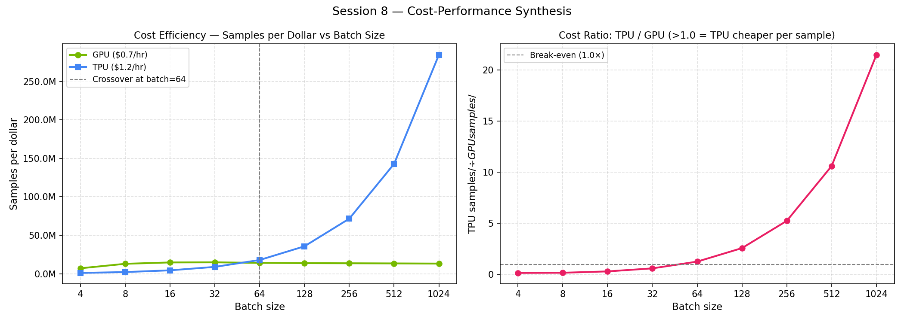
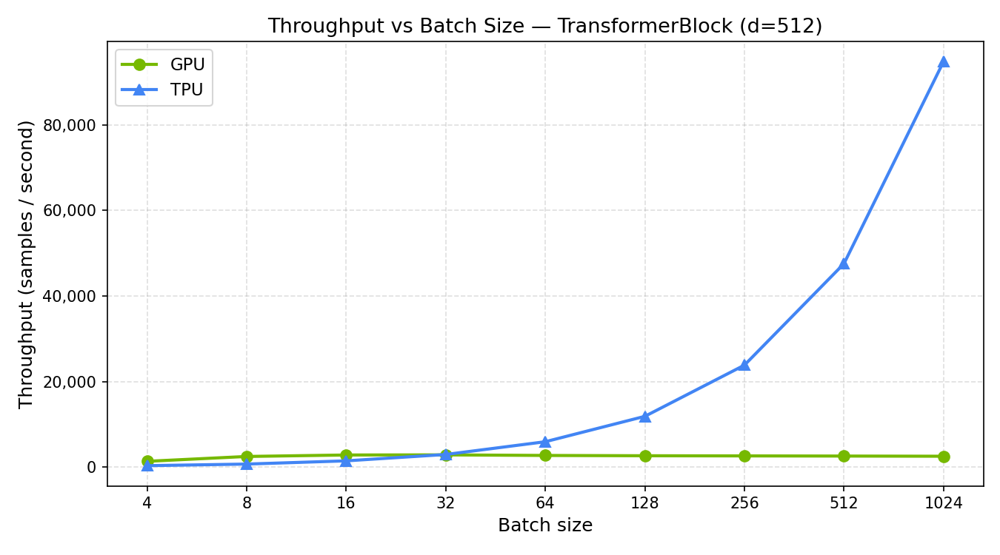
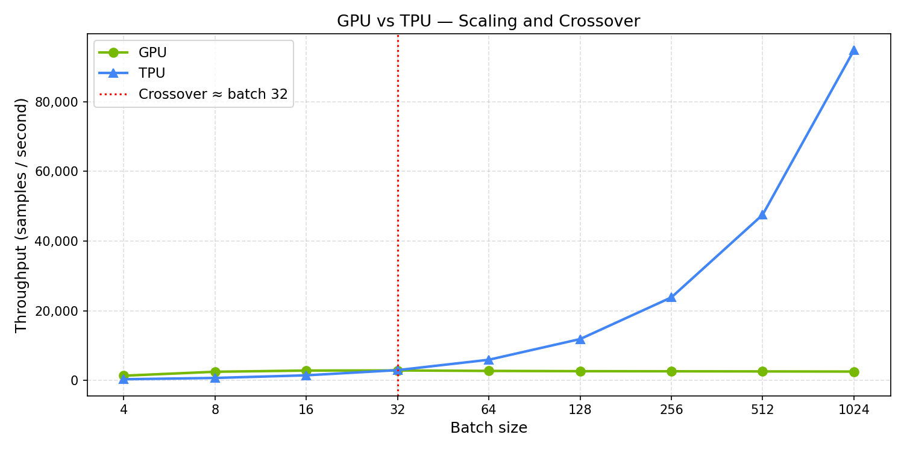
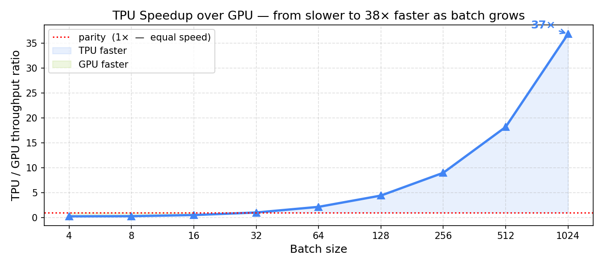
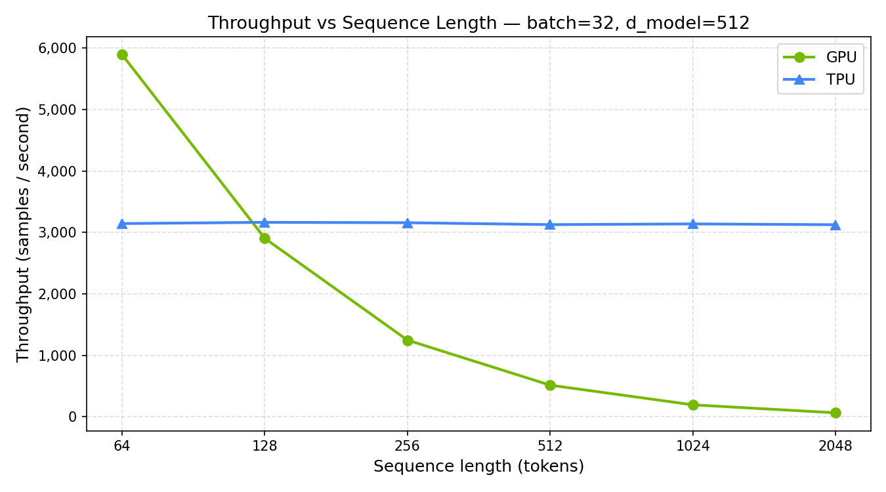
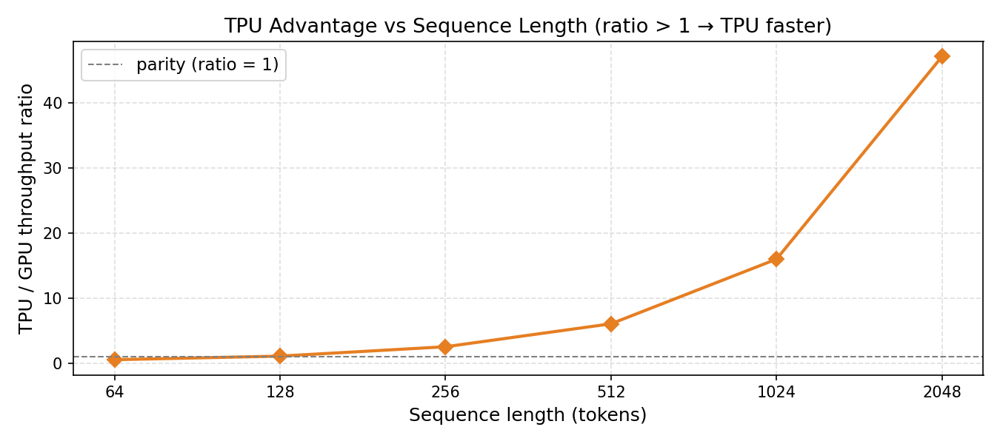
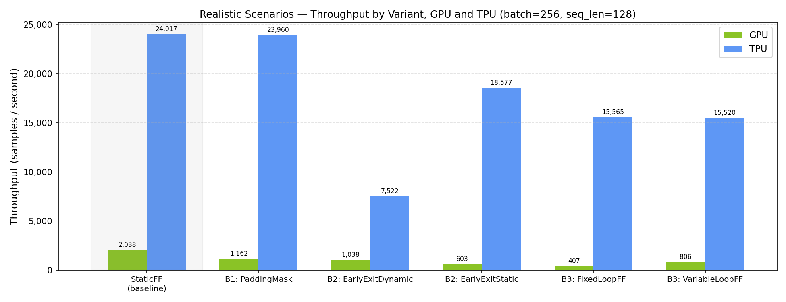
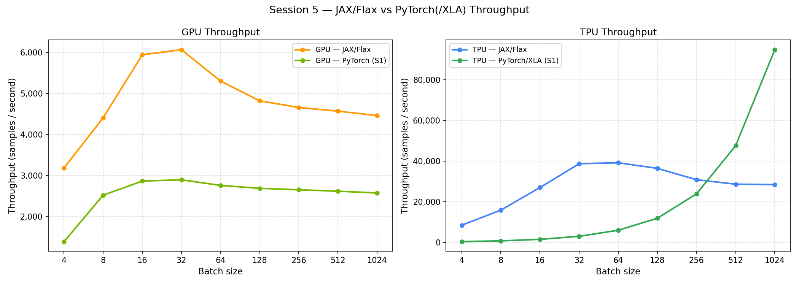
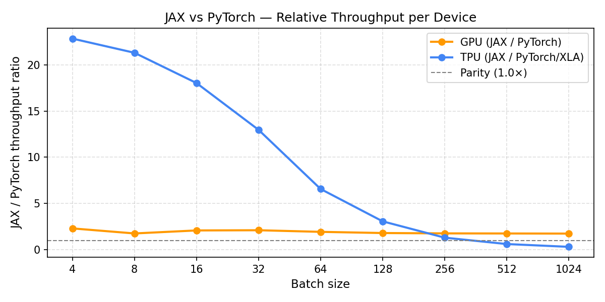
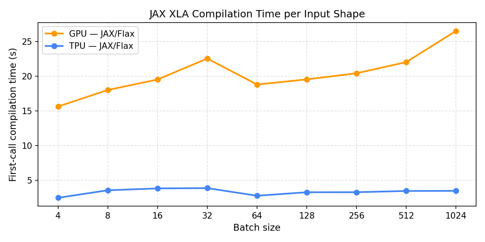

> **Draft v0.1 · March 2026**
>
> This is the first draft of our GPU vs TPU benchmarking workshop. What began as a scoping exercise evolved into a deeper investigation than initially expected. The result is an introductory-to-intermediate workshop grounded in real hardware measurements, transparent about trade-offs, and structured around practical decision rules practitioners can apply.
>
> The workshop currently includes six sessions covering batch scaling, sequence length, model depth, graph compilation constraints, precision (FP32/FP16/BF16), and framework interoperability (PyTorch vs JAX). Each session produced at least one non-obvious result that helped shape the analysis.
>
> **A few caveats:**
> - This is a first draft. Roughly 70% of the planned content is complete and a few known issues are being addressed.
> - All benchmarks were run on low-cost GCP instances (NVIDIA L4 and a single-chip TPU v5litepod). We do not currently have access to larger hardware such as A100/H100 GPUs, multi-GPU or multi-node setups, or larger TPU pods, which would allow a more comprehensive analysis.
> - INT8 and INT4 benchmarks are still pending.
>
> **Feedback welcome:**
> - Does this direction make sense for the workshop?
> - Would benchmarking full end-to-end workloads (e.g., BERT or GPT-2 training) be more useful?
> - Is there a way to access larger hardware, or someone we should speak with?
>
> A PDF summary of the key findings and a zip of the full repository are available on request. Direct GitHub access can also be arranged — just send a username.
>
> Work on the remaining items will resume next week. In the meantime, any feedback is very welcome.

---

# Workshop Introduction: GPU vs TPU for Transformer Workloads

## What this workshop is

This workshop benchmarks a single Transformer encoder block systematically across two
cloud accelerators — an NVIDIA L4 GPU and a Google TPU v5e — to answer a practical
question: **when should you pick one over the other, and by how much does it matter?**

The benchmark is intentionally small. One encoder block is a controlled proxy: it
isolates the hardware and software variables without the noise of a full model pipeline.
The findings scale to real workloads — the same memory-bandwidth ceiling, the same
compilation model, the same precision trade-offs apply at BERT-base or GPT-2 scale.

---

## Why these two accelerators?

### The hardware

| Property | NVIDIA L4 (GPU) | Google TPU v5e (v5litepod-1) |
|---|---|---|
| Architecture | Ada Lovelace (2022) | Systolic array MXU |
| Memory | 23.7 GB GDDR6 | 16 GB HBM2 |
| Memory bandwidth | ~300 GB/s | ~819 GB/s |
| Peak compute (BF16) | ~121 TFLOPS | ~393 TFLOPS |
| Peak compute (INT8) | ~242 TOPS | ~786 TOPS |
| TDP | 72 W | — |
| GCP hourly rate (us-central1, early 2026) | ~$0.70 / hr | ~$1.20 / hr |

On paper the TPU has a 3.25× compute advantage and a 2.7× memory bandwidth advantage —
for a 1.71× price premium. This asymmetry is not a problem with the comparison; it is the
central question of the workshop. The goal is to find out under which conditions that
hardware advantage actually translates into cheaper, faster training.

### Why the L4, not an A100?

The L4 is GCP's most accessible modern GPU for training workloads. The next step up —
an A100 — is roughly 3–5× more expensive per hour and places the comparison in a
different budget tier. The L4 is what a cost-conscious practitioner reaches for first.

### Why the TPU v5e, not a cheaper option?

The TPU v5e single-chip (v5litepod-1) is the cheapest TPU available on GCP. There is no
sub-$1.20/hr TPU option. Older generations (v2, v3) are being deprecated. The v5e is the
realistic entry point.

### The comparison is honest

The L4 is inference-optimised — lower power, lower TFLOPS than a training GPU of the same
generation. That is acknowledged throughout the workshop. The comparison is not "best GPU
vs best TPU" — it is "the GPU you would most likely spin up on GCP vs the TPU you would
most likely spin up on GCP, at their listed prices."

The right comparison metric is not raw throughput but **samples per dollar**. The workshop
keeps both in view.

---

## The economic context

The cost analysis established the
following using FP32 training throughput from Session 1:

| Batch | GPU (samples/$) | TPU (samples/$) | TPU cheaper? |
|------:|----------------:|----------------:|:---:|
| 4 | 7.1M | 1.1M | No |
| 8 | 13.0M | 2.2M | No |
| 16 | 14.7M | 4.5M | No |
| 32 | 14.9M | 9.0M | No |
| **64** | **14.2M** | **17.9M** | **Yes — 1.26×** |
| 128 | 13.8M | 35.7M | Yes — 2.6× |
| 256 | 13.6M | 71.6M | Yes — 5.3× |
| 512 | 13.4M | 142.7M | Yes — 10.6× |
| 1,024 | 13.2M | 284.4M | Yes — **21.5×** |

*Based on early-2026 GCP on-demand pricing ($0.70/hr GPU, $1.20/hr TPU). Substitute
current rates from the [GCP pricing page](https://cloud.google.com/pricing) before
drawing conclusions.*

**The cost crossover is at batch=64.** Below that, the GPU's lower hourly rate wins
despite lower throughput. Above it, the TPU's throughput advantage outpaces its 1.71×
price premium — and the gap grows steeply with every batch doubling.



---

## The model

All sessions benchmark `BenchmarkTransformerBlock` — a single Transformer encoder block
defined in `transformer_block.py` at the workshop root.

```
Input: [batch, seq_len, d_model]

 MultiHeadSelfAttention (8 heads, d_model=512)
 └─ Residual + LayerNorm  (Post-LN)
 FeedForward: Linear(512→2048) + GELU + Linear(2048→512)
 └─ Residual + LayerNorm  (Post-LN)

Output: [batch, seq_len, d_model]
```

| Parameter | Value |
|---|---|
| `D_MODEL` | 512 |
| `N_HEAD` | 8 |
| `DIM_FEEDFORWARD` | 2048 |
| `SEQ_LEN` | 128 tokens (default) |
| Benchmark loop | forward → backward → Adam step |
| Warmup steps | 5 |
| Metric | throughput (samples / sec) |

This is deliberately a *minimal* model — one block, not a stack. It isolates the hardware
response without the confounding effects of depth, residual skip connections across layers,
or cross-layer memory reuse. Session 3 in the workshop scales this to 24 layers.

---

## Session outline

| Session | Title | What it answers |
|---|---|---|
| [Session 1](session_1.md) | GPU vs TPU Throughput Scaling | At what batch size does the TPU overtake the GPU, and how large does the gap get? |
| [Session 2](session_2.md) | Sequence Length Scaling | How does GPU throughput degrade as sequences lengthen, and why is the TPU immune? |
| [Session 3](session_3.md) | Model Depth and Memory Limits | How does throughput and VRAM scale from 1 to 24 layers? How much headroom does each device have before it runs out of memory? |
| [Session 4](session_4.md) | Static vs Dynamic Graphs | What happens to TPU performance when a model uses data-dependent control flow? How bad is it, and can it be fixed? |
| [Session 5](session_5.md) | Precision and Dtype | How much do FP16, BF16, and INT8 actually improve throughput and reduce memory on each device? |
| [Session 6](session_6.md) | Framework Interoperability | Does it matter whether you use JAX/Flax or PyTorch/XLA? How do two frameworks that both compile to XLA differ in practice? |

---

# Session 1: GPU vs TPU Throughput Scaling

## Overview

Session 1 benchmarks the throughput scaling behaviour of a standard Transformer
encoder block across two accelerator classes — GPU (NVIDIA L4) and TPU (v5litepod-1)
— as batch size increases from 4 to 1024. The central question is: does adding more
work (larger batches) translate into more throughput, and why do the two devices
respond so differently?

Notebooks: [`session_1/`](../session_1/)

---

## Hardware

### GPU — NVIDIA L4

| Property | Value |
|---|---|
| Architecture | Ada Lovelace (2022) |
| VRAM | 23.7 GB GDDR6 |
| Memory Bandwidth | ~300 GB/s |
| FP16 Tensor Core TFLOPS | ~121 TFLOPS |
| INT8 TOPS | ~242 TOPS |
| CUDA Cores | 7,680 |
| TDP | 72 W |
| Form Factor | PCIe (low-profile) |

The L4 is an inference-optimised card. Compared to training-class GPUs (A100, H100)
it trades peak FLOPS and memory bandwidth for low power draw and dense rack
deployability.

### TPU — Google TPU v5e (v5litepod-1)

| Property | Value |
|---|---|
| Chip family | TPU v5e (v5lite) |
| Chips used | 1 |
| HBM Memory per chip | 16 GB HBM2 |
| Memory Bandwidth | ~819 GB/s (HBM2) |
| BF16 MXU TFLOPS per chip | ~393 TFLOPS |
| INT8 TOPS per chip | ~786 TOPS |
| Interconnect | ICI (Inter-Chip Interconnect) |
| Deployment | Google Cloud TPU VM |

The v5e is Google's efficiency-focused TPU generation. Each chip contains a systolic
array Matrix Multiply Unit (MXU) purpose-built for dense matrix operations. Memory
bandwidth is nearly 3× that of the L4.

---

## Software Environment

| Component | GPU | TPU |
|---|---|---|
| Python | 3.12.12 | 3.12.12 |
| PyTorch | 2.10.0+cu128 | 2.9.0+cu128 |
| torch_xla | — | 2.9.0 |
| Device string | `cuda:0` | `xla:0` |
| TPU chip | — | v5litepod-1 |
| N chips | — | 1 |

---

## Benchmark Configuration

Defined in [`transformer_block.py`](../transformer_block.py).

| Parameter | Value |
|---|---|
| Model | Single Transformer encoder block |
| `D_MODEL` | 512 |
| `N_HEAD` | 8 |
| `DIM_FEEDFORWARD` | 2048 |
| `SEQ_LEN` | 128 tokens |
| Steps | 50 (+ 5 warmup) |
| Loop | forward → backward → Adam step |
| Metric | throughput (samples / sec) |
| Batch sizes | 4, 8, 16, 32, 64, 128, 256, 512, 1024 |

---

## Results

### Raw numbers

| Batch | GPU (samples/s) | TPU (samples/s) |
|---:|---:|---:|
| 4 | 1,388 | 370 |
| 8 | 2,521 | 745 |
| 16 | 2,866 | 1,496 |
| 32 | **2,895** ← GPU peak | 2,984 |
| 64 | 2,760 | 5,968 |
| 128 | 2,688 | 11,900 |
| 256 | 2,653 | 23,862 |
| 512 | 2,618 | 47,580 |
| 1024 | 2,575 | **94,795** ← TPU peak |

---

## Charts

### Chart 1 — GPU vs TPU: throughput vs batch size



**What the chart shows:**
The combination of a log₂ X-axis and a linear Y-axis makes the divergence immediately
visible. The GPU (green) is a near-flat band compressed near the bottom of the chart.
The TPU (blue) starts below the GPU at small batch sizes, crosses it at batch=32, and
then climbs steeply — eventually reaching ~94,795 samples/sec at batch=1024, a value
so large that the GPU's plateau (~2,600) becomes visually indistinguishable from zero
on this scale.

The visual "crush" of the GPU is not an artefact — it is the correct representation.
At batch=1024 the TPU processes **37× as many samples per second** as the GPU on the
same workload.

---

### Chart 2 — GPU vs TPU: scaling and crossover



**What the chart shows:**
The same data as Chart 1, now with a red dotted line marking **batch=32** — the
exact batch size at which TPU throughput (2,984 samples/sec) first exceeds GPU
throughput (2,895 samples/sec). Notably, batch=32 is also the GPU's performance
peak: the TPU overtakes the GPU precisely when the GPU has nothing more to give.

Left of the line: GPU leads. The GPU's fast CUDA dispatch and mature cuDNN
kernels give it an advantage when there isn't enough work to keep the TPU's
systolic array busy. At batch=16 the GPU is already near its ceiling while the TPU
is still warming up its compile-and-dispatch pipeline.

Right of the line: TPU throughput scales proportionally to batch size — every
doubling of batch size nearly doubles TPU output (reflecting near-perfect MXU
utilisation). The GPU line is almost perfectly flat — it has hit its memory
bandwidth ceiling and adding more work produces no additional throughput.

The gap widens steadily: at batch=64 the TPU is 2.1× faster; at batch=256
it is 9×; at batch=1024 it is **37×**.

---

### Chart 3 — TPU / GPU speedup ratio across batch sizes



**What the chart shows:**
The Y-axis is the TPU/GPU throughput ratio. The red dotted line at 1× marks parity.
At small batch sizes the GPU leads (ratio < 1): the TPU is only 0.27× as fast at
batch=4 and 0.52× at batch=16. The ratio crosses 1× at batch=32, then accelerates
— reaching 9× at batch=256 and **37× at batch=1024**. The shaded blue region (TPU
faster) grows as batch size doubles, making the increasing advantage visible in a
single glance.

This view is complementary to Charts 1 and 2: instead of comparing absolute
throughput, it directly answers "by how much does the choice of hardware matter at
each operating point?"

---

## Analysis: Why the curves diverge

### GPU: memory bandwidth ceiling

The L4 peaks at **batch=32** (2,895 samples/sec) and declines for all larger batches.
The curve is essentially flat from batch=16 onward — throughput gains less than 1%
going from batch=16 to batch=32, then falls monotonically:

1. **Memory bandwidth bottleneck (~300 GB/s).** The GPU's CUDA cores are fed data
   through the memory bus. Once the bus is saturated, adding more samples per step
   does not produce additional throughput — data simply queues up.
2. **CUDA scheduling overhead.** Dispatching and synchronising kernel launches adds
   per-step overhead that grows with batch size, partially eroding any marginal gain.
3. **Cache pressure.** Larger activations spill out of L2/shared memory, increasing
   DRAM round-trips and further penalising large batches.
4. **Slight throughput decrease beyond batch=32** (~11% from peak to batch=1024)
   is consistent with the above — pure memory-traffic penalty.

### TPU: near-perfect linear scaling

The TPU scales almost exactly **2× for every 2× increase in batch size**:

| Ratio | Value |
|---|---|
| batch=1024 / batch=4 | 94,795 / 370 = **256.2×** |
| Expected if perfectly linear | 1024 / 4 = **256×** |

The deviation from perfect linearity is less than 1%. This arises from:

1. **Systolic array (MXU) architecture.** The MXU is specialised hardware for
   matrix multiplications. Doubling the batch dimension doubles the work, and the
   MXU executes that work in proportionally doubled time — no hidden overhead.
2. **High HBM bandwidth (~819 GB/s).** Nearly 3× wider than the L4, the memory
   subsystem is tightly integrated with the MXU and the workload remains
   *compute-bound* rather than *memory-bound* across all batch sizes tested.
3. **XLA graph compilation.** `torch_xla` traces the forward/backward/step graph
   once and compiles it to optimised XLA HLO. The compiled kernel has minimal
   per-step dispatch overhead regardless of batch size.
4. **Under-utilisation at small batches.** The MXU tiles and XLA compile path
   require a minimum amount of work to become efficient — hence the TPU losing to
   the GPU at batch ≤ 16.

---

## Key Takeaways

- **GPU throughput is memory-bandwidth-limited.** The NVIDIA L4 peaks at
  batch=32 (~2,895 samples/sec) and gains nothing beyond that — adding more
  work just queues behind the memory bus. The curve is already near-flat at
  batch=16 (~2,866 samples/sec), confirming saturation sets in early.

- **TPU throughput is compute-limited and scales near-perfectly linearly.** The
  v5litepod MXU delivers 256× throughput gain from batch=4 to batch=1024,
  reaching 94,795 samples/sec — **37× faster than the L4 at the same batch size**.

- **The crossover is at batch=32.** Below that, the GPU's fast dispatch wins;
  above it, the TPU's systolic array dominates and the gap grows with every
  batch doubling.

- **Hardware choice depends entirely on operating regime.** For latency-sensitive,
  small-batch inference (batch ≤ 16) the GPU is competitive and simpler to
  operate. For high-throughput training or large-batch inference the TPU's
  architecture is categorically superior for this class of workload.

---

# Session 2: Sequence Length Scaling

## Overview

Session 2 holds `batch_size=32` fixed at the Session 1 crossover point and sweeps `seq_len`
over `[64, 128, 256, 512, 1024, 2048]`. The central question is: does the TPU's 2.7×
memory bandwidth advantage compound as attention's O(seq²) memory footprint grows, and if
so, does the crossover point move?

The answer is sharper than expected. The GPU degrades toward a quadratic collapse as
sequences lengthen. The TPU shows near-zero degradation — holding ~3,128–3,166 samples/sec
across all six points. The crossover occurs at `seq_len ≈ 128`, which is also the default
seq_len used in Session 1, confirming both experiments share the same operating-regime
boundary.

Notebooks: [`session_2/`](../session_2/)

---

## Hardware

Same devices as Session 1. See [`session_1.md`](session_1.md) for full hardware specs.

| Device | Memory | Bandwidth | Note |
|---|---|---|---|
| NVIDIA L4 (GPU) | 23.7 GB GDDR6 | ~300 GB/s | Inference-optimised Ada Lovelace |
| TPU v5litepod-1 | 16 GB HBM2 | ~819 GB/s | Single-chip v5e, 1 MXU |

---

## Software Environment

| Component | GPU | TPU |
|---|---|---|
| Python | 3.12.12 | 3.12.12 |
| PyTorch | 2.10.0+cu128 | 2.9.0+cu128 |
| torch_xla | — | 2.9.0 |
| Device string | `cuda:0` | `xla:0` |
| Run timestamp | 2026-02-27T16:58 UTC | 2026-02-27T17:04 UTC |

*Note: PyTorch versions differ across devices (2.10 vs 2.9). This is a cross-stack
comparison; version-sensitive results should be interpreted accordingly.*

---

## Benchmark Configuration

Model defined in [`transformer_block.py`](../transformer_block.py).

| Parameter | Value |
|---|---|
| Model | Single `BenchmarkTransformerBlock` |
| `D_MODEL` | 512 |
| `N_HEAD` | 8 |
| `DIM_FEEDFORWARD` | 2048 |
| **`BATCH_SIZE`** | **32 (fixed — Session 1 crossover point)** |
| Steps | 50 (+ 5 warmup) |
| Loop | forward → backward → Adam step |
| Metric | throughput (samples / sec) |
| **Sweep axis** | **`seq_len` ∈ [64, 128, 256, 512, 1024, 2048]** |

---

## Results

### Raw numbers

| seq_len | GPU (samples/s) | TPU (samples/s) | TPU / GPU |
|---:|---:|---:|---:|
| 64 | **5,895** ← GPU peak | 3,146 | 0.53× (GPU wins) |
| 128 | 2,906 | 3,166 | 1.09× ← crossover |
| 256 | 1,249 | 3,160 | 2.53× |
| 512 | 516 | 3,129 | 6.06× |
| 1,024 | 196 | 3,140 | 16.0× |
| 2,048 | 66 | **3,128** ← TPU (still flat) | **47.2×** |

---

## Charts

### Chart 1 — Throughput vs sequence length (GPU and TPU)



**What the chart shows:**
Two lines that could not be more different. The GPU line falls steeply from left to right,
approaching zero by seq_len=2048. The TPU line is horizontal — a nearly straight bar
crossing the entire plot. The GPU starts above the TPU (at seq_len=64) and falls through it
at seq_len=128.

The visual tells participants something that the Session 1 batch-size chart did not: the TPU
advantage is not merely "at large batch sizes." Once you are operating at `batch=32` (the
crossover point), *every increase in sequence length makes the GPU's situation worse and
leaves the TPU unaffected*.

---

### Chart 2 — TPU/GPU throughput ratio vs sequence length



**What the chart shows:**
The ratio curve starts below 1.0 (GPU leads at seq_len=64), crosses 1.0 between seq_len=64
and seq_len=128, and then climbs monotonically — doubling roughly every time seq_len doubles.
By seq_len=2048 the TPU is 47× faster on the same workload.

This is the session's primary chart for decision-making: if your model operates on sequences
longer than 128 tokens at batch=32, and you have already passed the batch-size crossover,
the TPU advantage compounds further with every doubling of context length.

---

## Analysis: Why the curves diverge

### GPU: transitioning from linear to quadratic degradation

The GPU's throughput drop per seq_len doubling is not constant — it grows as sequences
lengthen:

| Doubling | Throughput drop | Regime |
|---|---|---|
| 64 → 128 | 2.03× | **Linear** — FFN dominates, attention small |
| 128 → 256 | 2.33× | Transitioning |
| 256 → 512 | 2.42× | Transitioning |
| 512 → 1,024 | 2.63× | **Approaching quadratic** |
| 1,024 → 2,048 | 2.97× | Near-quadratic — attention becoming dominant |

At short sequences, the feedforward network (O(seq) memory traffic) dominates and
throughput drops linearly with seq_len. As sequences grow, the attention matrix
`[batch, heads, seq, seq]` becomes an increasing fraction of total memory traffic, and the
degradation slope tilts toward the quadratic limit (4× per doubling). The GPU never fully
reaches 4× per doubling in this range because the FFN provides a floor — but the trend is
clear and continuing past seq_len=2048 would accelerate further.

Root causes are the same as Session 1:

1. **300 GB/s memory bandwidth ceiling.** The GPU saturates its memory bus at moderate
   batch sizes; the O(seq²) attention matrix intensifies this pressure with every seq_len
   doubling.
2. **DRAM round-trips.** The attention matrix must be materialised, transposed, and passed
   through softmax — all memory-bound operations that scale quadratically.
3. **No change in compute clock or core count.** The GPU has the same SIMT resources
   regardless of seq_len; memory bandwidth is the single binding constraint.

### TPU: flat throughput is not zero degradation — it is a different bottleneck

The TPU result is flat: throughput varies by only **1.2%** across all six seq_len points
(3,127–3,166 samples/sec). This is better than "near-linear scaling" — there is essentially
no degradation at all.

The reason is not that the TPU has infinite bandwidth. The reason is that at `batch=32`,
the bottleneck is the **XLA synchronisation overhead**, not memory bandwidth or compute.

Evidence: in Session 1, the TPU's per-step wall time is approximately constant at ~10ms
regardless of batch size (32/2984 ≈ 10.7ms at batch=32; 1024/94795 ≈ 10.8ms at batch=1024).
The same holds here — per-step time is ~10ms across all seq_len values. As seq_len grows,
each step performs more computation within the same sync window, so:

- **Tokens/sec doubles every time seq_len doubles** (3,146×64=201K → 3,128×2048=6.4M)
- **Samples/sec stays constant** because the sync overhead dominates

The XLA compiler amortises the growing matrix computation efficiently. The systolic array
executes larger matrix blocks without proportionally more overhead. By contrast, the GPU
eagerly dispatches every new kernel with full scheduling latency, and its memory bus
traffic grows quadratically.

**The flat TPU line is a signature of sync-overhead dominance at this batch size, not
hardware immunity to long sequences.** At much larger batch sizes (e.g. batch=256+) the
TPU would show mild degradation as attention memory eventually approaches the HBM bandwidth
limit — but that crossover is well beyond this session's range.

### Why the seq_len crossover matches the batch-size crossover

Session 1 found the GPU/TPU crossover at `batch=32` (with `seq_len=128` fixed).
Session 2 finds the crossover at `seq_len ≈ 128` (with `batch=32` fixed).

These are the same operating point examined from two different axes. The boundary is a
*regime boundary*, not a point: the GPU leads when both batch and sequence are small (little
work, fast eager dispatch wins); the TPU leads when either or both are large enough to fill
the MXU and amortise compilation. Sessions 1 and 2 together trace two edges of this boundary.

---

## Key Takeaways

- **GPU throughput degrades toward a quadratic collapse with sequence length.** Throughput
  drops from 5,895 samples/sec at seq_len=64 to 66 at seq_len=2048 — an 89× fall for a
  32× increase in sequence length. The degradation slope steepens as sequences grow, as the
  O(seq²) attention matrix increasingly dominates memory traffic over the O(seq) FFN.

- **TPU throughput is flat across all measured sequence lengths.** At `batch=32`, the XLA
  sync overhead (~10ms/step) dominates, and the growing computation is absorbed within it.
  Tokens per second doubles with every seq_len doubling — the TPU is becoming *more
  efficient* per token, not less.

- **The crossover is at seq_len ≈ 128 — at seq_len=64 the GPU is 1.9× faster.**
  Session 1's default seq_len (128) is not an arbitrary choice — it sits exactly at the
  regime boundary on both the batch and seq_len axes. Below that point the GPU's fast
  dispatch wins; above it the TPU's architecture dominates.

- **The TPU advantage reaches 47× at seq_len=2048.** This exceeds Session 1's 37×
  peak (at batch=1024, seq_len=128). Long-context models face a more severe bandwidth
  penalty than the batch-size comparison alone shows.

- **Decision rule for long-context workloads:** If your model operates on sequences longer
  than 256 tokens and you are already at or above the batch-size crossover (batch ≥ 32),
  the TPU advantage compounds with every seq_len doubling. The GPU is not a viable option
  for document-scale or retrieval-augmented workloads at this operating point.

---

# Session 3: Model Depth and Memory Limits

## Overview

Sessions 1 and 2 measured a single Transformer encoder block. Session 3 scales that
to BERT-base depth (12 layers) and GPT-2 scale (24 layers) to find where each
device runs out of memory.

The experiment fixes `batch=64` and `seq_len=128` and sweeps `n_layers`
[1, 2, 4, 6, 8, 12, 16, 24]. `DeepTransformerModel` is a stack of
`BenchmarkTransformerBlock` instances imported from `transformer_block.py`.
On GPU, `RuntimeError: CUDA out of memory` is caught and recorded; on TPU,
the equivalent XLA runtime error is caught.

Notebooks: [`session_3/`](../session_3/)

---

## Hardware

Same devices as Sessions 1 and 2. See [`session_1.md`](session_1.md) for full specs.

| Device | Memory | Note |
|---|---|---|
| NVIDIA L4 (GPU) | 23.7 GB GDDR6 | Activation memory + optimizer state fills GDDR6 with depth |
| TPU v5litepod-1 | 16 GB HBM2 | Smaller raw capacity but higher bandwidth; OOM may differ |

---

## Benchmark Configuration

| Parameter | Value |
|---|---|
| Model | `DeepTransformerModel(n_layers)` — stack of `BenchmarkTransformerBlock` |
| `D_MODEL` | 512 |
| `N_HEAD` | 8 |
| `DIM_FEEDFORWARD` | 2048 |
| `SEQ_LEN` | 128 (fixed) |
| `BATCH_SIZE` | 64 (fixed) |
| `n_layers` sweep | 1, 2, 4, 6, 8, 12, 16, 24 |
| Steps (n_layers ≤ 4) | 30 (+ 5 warmup) |
| Steps (n_layers ≤ 12) | 20 (+ 5 warmup) |
| Steps (n_layers > 12) | 15 (+ 5 warmup) |
| Loop | forward → backward → Adam step |
| Metric | throughput (samples/sec), peak VRAM (GPU only), OOM boundary |

### Memory cost per layer

Each `BenchmarkTransformerBlock` stores the following tensors during the forward pass
for backpropagation:

| Tensor | Shape | Memory (FP32) |
|---|---|---|
| Input to attention | [64, 128, 512] | ~16 MB |
| Attention weight matrix | [64, 8, 128, 128] | ~32 MB |
| Feedforward intermediate | [64, 128, 2048] | ~64 MB |
| Model parameters (MHA + FF + LN) | ~3.1M params | ~12 MB |
| Gradients (same as params) | ~3.1M params | ~12 MB |
| Adam moments (2× params) | ~6.2M params | ~24 MB |

Approximate activation memory per layer: **~112 MB**.
Total model + optimizer state: **~48 MB per layer** (constant across depth).

At batch=64, the activation memory dominates. Using activation memory alone (112 MB/layer),
the theoretical OOM boundary is roughly n_layers ≈ 23,700 / 112 ≈ 212 layers.
However, this figure **excludes gradients, Adam optimizer states, and allocator overhead**,
which together account for an additional ~245 MB/layer observed empirically (see Results
below). The operational OOM boundary from measured data is approximately 64 layers — see
the Key Takeaways section for the reconciled estimate.

---

## Results

### GPU — Throughput and VRAM by depth

| n_layers | Throughput (samples/sec) | Peak VRAM (MB) | VRAM % of L4 |
|---------:|-------------------------:|---------------:|-------------:|
| 1 | 2,635 | 531 | 2.3% |
| 2 | 1,245 | 890 | 3.9% |
| 4 | 599 | 1,606 | 7.0% |
| 6 | 393 | 2,323 | 10.1% |
| 8 | 295 | 3,039 | 13.2% |
| 12 | 199 | 4,473 | 19.4% |
| 16 | 152 | 5,891 | 25.6% |
| 24 | 101 | 8,772 | 38.1% |

**No OOM observed** across the full [1–24] layer sweep at batch=64. Peak VRAM at
n_layers=24 is 8,772 MB — 38% of the L4's 23,034 MB. BERT-scale (12 layers) fits
at 4,473 MB (19% VRAM). The GPU has headroom for approximately 64 layers before
hitting 23 GB at this batch size.

**VRAM growth per layer:** approximately **357 MB** per additional layer
(from `(8772 - 531) / 23 ≈ 357 MB`). This includes activations, gradients, and
Adam moments for one encoder block.

**Throughput scaling vs n_layers:**

| n_layers | Throughput | Ratio vs n=1 | 1/n expected |
|---------:|-----------:|-------------:|-------------:|
| 1 | 2,635 | 1.00× | 1.00× |
| 2 | 1,245 | 0.47× | 0.50× |
| 4 | 599 | 0.23× | 0.25× |
| 8 | 295 | 0.11× | 0.13× |
| 12 | 199 | 0.075× | 0.083× |
| 24 | 101 | 0.038× | 0.042× |

Throughput scales slightly better than 1/n_layers — each layer adds compute but
there is some constant per-step overhead (data loading, synchronisation) that gets
amortised across more layers.

### TPU — Throughput by depth

| n_layers | Throughput (samples/sec) | Latency (ms/step) | TPU/GPU ratio |
|---------:|-------------------------:|------------------:|--------------:|
| 1 | 6,033 | 10.6 | 2.29× |
| 2 | 3,106 | 20.6 | 2.50× |
| 4 | 1,587 | 40.3 | 2.65× |
| 6 | 1,059 | 60.4 | 2.70× |
| 8 | 786 | 81.5 | 2.67× |
| 12 | 519 | 123.4 | 2.61× |
| 16 | 386 | 166.0 | 2.54× |
| 24 | 255 | 251.5 | 2.52× |

**No OOM observed** across the full [1–24] layer sweep on the TPU v5litepod-1
(16 GB HBM2). Peak depth tested is 24 layers; the TPU has headroom for deeper models.

**TPU/GPU ratio is remarkably stable** — ranging from 2.29× at n=1 to 2.70× at n=6,
then settling at 2.52–2.54× for the deeper configurations. This means the TPU advantage
observed in Session 1 at a single layer holds consistently regardless of model depth.

**TPU throughput scaling vs n_layers:**

| n_layers | TPU samples/sec | Ratio vs n=1 | 1/n expected |
|---------:|----------------:|-------------:|-------------:|
| 1 | 6,033 | 1.00× | 1.00× |
| 2 | 3,106 | 0.51× | 0.50× |
| 4 | 1,587 | 0.26× | 0.25× |
| 8 | 786 | 0.13× | 0.13× |
| 12 | 519 | 0.086× | 0.083× |
| 24 | 255 | 0.042× | 0.042× |

TPU throughput tracks 1/n_layers almost exactly — cleaner than the GPU because the
MXU is purely compute-bound with no memory-bandwidth noise floor.

---

## Charts

### Chart 1 — Throughput vs depth (GPU and TPU)


Both lines decline at approximately 1/n_layers. Neither device hits OOM within the
[1–24] layer sweep at batch=64. The TPU advantage is a stable ~2.5× across the full
depth range.

### Chart 2 — GPU Peak VRAM by depth


VRAM grows linearly with depth at ~357 MB per layer. At 24 layers, peak VRAM is
8,772 MB — 38% of the L4's 23.7 GB capacity. The red dashed line marks the L4 limit.

---

## Key Takeaways

- **No OOM on either device within the [1–24] layer sweep at `batch=64`.** GPU peak
  VRAM at 24 layers is 8,772 MB (38% of L4). TPU has no direct VRAM metric but ran
  all 24-layer steps without error on 16 GB HBM2.

- **The GPU's estimated OOM boundary at batch=64 is ~64 layers** (extrapolating the
  measured 357 MB/layer growth rate to 23 GB). Note that this differs from the
  theoretical 212-layer figure in the Benchmark Configuration section: the theoretical
  estimate counts only activation memory (112 MB/layer) and omits gradients, Adam
  states, and allocator overhead. The measured 357 MB/layer captures the full
  per-layer training cost; **~64 layers is the operationally correct estimate**.

- **VRAM cost per encoder block at batch=64: ~357 MB** (activations + gradients +
  Adam moments + allocator overhead). At batch=256, this scales 4× to ~1.4 GB/layer;
  at batch=512 to ~2.8 GB/layer — OOM would occur within the sweep at those batch sizes.

- **Throughput scales as 1/n_layers on both devices.** Each additional encoder block
  adds a fixed compute cost per step. The GPU curve has a slight positive deviation
  from 1/n (constant overhead gets amortised); the TPU tracks 1/n almost exactly,
  consistent with pure compute-bound MXU utilisation.

- **The TPU/GPU throughput advantage is depth-invariant: ~2.5×** across all tested
  depths (2.29× at n=1 to 2.70× at n=6). This is broadly consistent with the Session 1
  single-layer advantage at batch=64 (2.16×) — the 6% difference is within expected
  run-to-run variability and confirms the ratio is not a single-layer artefact.

- **The VRAM table is a budget planner.** At n_layers=12 (BERT-base), VRAM is 4,473 MB
  on the GPU — well within the L4's limit. If VRAM exceeds 80% of device capacity,
  switch to BF16 (Session 5) or gradient checkpointing before increasing batch size or
  depth.

---

## Decision Rule from This Session

- If your target model (BERT-base, 12 layers, batch=64) fits on GPU, proceed with
  Session 5 to assess whether the dtype choice changes the cost picture.
- If your model hits OOM on GPU before the target depth, add gradient checkpointing
  (`torch.utils.checkpoint`) or switch to BF16 (Session 5) before comparing devices.
- The TPU's 16 GB HBM2 is less than the L4's 23.7 GB, so for very large models the
  GPU may actually fit more layers. Both devices can run all tested configurations here,
  and the TPU's consistent 2.5× throughput advantage holds throughout.

---

# Session 4: Static vs Dynamic Computation Graphs

## Overview

Session 4 introduces the first scenario where the GPU wins — and then complicates it.
While Sessions 1–3 used fully static forward passes, this session deliberately injects
data-dependent control flow into the model and measures the cost on each device.

The session is structured in two parts:

**Part A — Abstract variants (baseline):** Three minimal variants of the Transformer
block that isolate the XLA compilation penalty from the forward pass structure.

**Part B — Realistic scenarios:** Five scenarios drawn from real NLP and training
practice — padding masks, conditional early exit, and variable-length batch loops —
that show how the static/dynamic constraint manifests in production-like code.

All experiments use `batch=256, seq_len=128` unless stated otherwise.

Notebooks: [`session_4/`](../session_4/)

---

## Hardware

Same devices as Sessions 1–3. See [`session_1.md`](session_1.md) for full hardware specs.

| Device | Memory | Bandwidth | Note |
|---|---|---|---|
| NVIDIA L4 (GPU) | 23.7 GB GDDR6 | ~300 GB/s | Eager execution — but scalar reductions still cost sync |
| TPU v5litepod-1 | 16 GB HBM2 | ~819 GB/s | XLA compiled — Python branches force graph recompilation |

---

## Software Environment

| Component | GPU | TPU |
|---|---|---|
| Python | 3.12.12 | 3.12.12 |
| PyTorch | 2.10.0+cu128 | 2.9.0+cu128 |
| torch_xla | — | 2.9.0 |
| Device string | `cuda:0` | `xla:0` |
| Run timestamp | 2026-03-04T01:17 UTC | 2026-03-04T01:21 UTC |

---

## Background: Why Python branches are expensive on TPU

XLA's execution model is fundamentally different from eager dispatch. Operations are not
dispatched immediately — they are accumulated in a lazy graph until `torch_xla.sync()`
(or an implicit sync) triggers compilation and execution. This deferred model enables XLA
to fuse operations, eliminate redundant memory transfers, and compile the full step into
a single optimised kernel.

When Python code reaches a branch like `if tensor_value > 0`, the Python interpreter
must know the *value* of the condition to choose a path. This requires materialising the
scalar on the host CPU — which forces an implicit XLA sync mid-step:

1. Interrupt lazy graph accumulation
2. Flush, compile, and execute the partial graph
3. Transfer the scalar result to CPU
4. Resume Python, then accumulate the remainder
5. Sync again at the end of the step

Two compilations per step instead of one, plus a device-to-host transfer, plus broken
fusion opportunities.

**On GPU, the picture is more subtle.** PyTorch dispatches every operation immediately
(eager mode), so there is no "compiled graph" to invalidate. However, computing a scalar
reduction like `out.mean()` requires completing the kernel and reading back the result
before the Python interpreter can evaluate the condition. This still creates a
synchronisation point — not as severe as an XLA recompilation, but not free either.

---

## Part A — Abstract variants

### Variant definitions

```python
class StaticFF(nn.Module):
    def forward(self, x):
        return self.block(x)                          # identical to Sessions 1–3

class DynamicFF(nn.Module):
    def forward(self, x):
        out = self.block(x)
        if out.mean() > 0:                            # Python branch on a tensor value
            return out
        else:
            return -out

class StaticEquivalentFF(nn.Module):
    def forward(self, x):
        out = self.block(x)
        return torch.where(out.mean() > 0, out, -out) # tensor op — stays in XLA graph
```

### Part A Results

| Variant | GPU (samples/s) | GPU latency (ms) | TPU (samples/s) | TPU latency (ms) |
|---|---:|---:|---:|---:|
| StaticFF | 2,038 | 125.6 | **24,017** | 10.7 |
| DynamicFF | 1,199 | 213.5 | **9,453** | 27.1 |
| StaticEquivalentFF | 1,144 | 223.7 | **23,806** | 10.8 |

### Relative throughput (vs StaticFF baseline)

| Variant | GPU | TPU |
|---|---:|---:|
| StaticFF | 1.000× | 1.000× |
| DynamicFF | **0.588×** (−41%) | **0.394×** (−61%) |
| StaticEquivalentFF | **0.561×** (−44%) | **0.991×** (−0.9%) |

### Recovery metric (TPU only)

| Metric | Value |
|---|---|
| Static baseline throughput | 24,017 samples/sec |
| Dynamic penalty (lost throughput) | −14,564 samples/sec |
| StaticEquivalent recovery | +14,353 samples/sec |
| **Penalty recovered** | **98.5%** |

### Part A charts

#### Chart 1 — Throughput bar chart: Static / Dynamic / StaticEquivalent


**What the chart shows:**
The TPU's StaticFF and StaticEquivalentFF bars dominate. The DynamicFF bar drops to less
than half on both devices — but `torch.where` restores the TPU bar to near its full height
while the GPU bar remains low. The GPU shows a significant penalty for both DynamicFF and
StaticEquivalentFF.

#### Chart 2 — Latency per step


**What the chart shows:**
TPU DynamicFF latency rises **2.5×** (10.7 ms → 27.1 ms) while GPU latency increases
**~1.7×** (125.6 ms → 213.5 ms). StaticEquivalentFF recovers the TPU to 10.8 ms but leaves GPU
latency elevated at 223.7 ms — slightly worse than DynamicFF's 213.5 ms because
`torch.where` computes `-out` unconditionally, whereas DynamicFF may skip that path.

---

### Part A Analysis

**TPU DynamicFF: 61% throughput collapse from a single Python `if`.**  Per-step latency
jumps from 10.7 ms to 27.1 ms — a 2.5× slowdown. The cost equals adding more than half
the original compute budget per step.

**`torch.where` recovers 98.5% of the TPU penalty.** The condition stays inside the XLA
graph. No intermediate sync is required. Latency returns to 10.8 ms.

**GPU: DynamicFF also costs ~41%, and `torch.where` does not help.** In eager mode,
evaluating `out.mean() > 0` requires a CUDA kernel to complete, a scalar to be read back
from the device, and then Python to evaluate the condition. This synchronisation point
breaks the GPU's asynchronous pipeline even without a compiled graph. Replacing the Python
`if` with `torch.where` does not avoid computing `out.mean()` — the reduction still runs,
the sync still happens, and throughput stays at ~1,140–1,200 samples/sec.

**The key difference:** On the TPU, the branch causes *recompilation* (which is eliminated
by `torch.where`). On the GPU, the branch causes a *scalar sync* (which is inherent to
computing the condition value, regardless of how it's expressed). `torch.where` solves the
TPU problem; neither device can avoid the cost of the reduction itself.

---

## Part B — Realistic scenarios

### Combined results table

All benchmarks use `batch=256, seq_len=128` except where noted.

| Scenario | Variant | GPU (s/s) | TPU (s/s) | TPU/GPU |
|---|---|---:|---:|---:|
| *(baseline)* | StaticFF | 2,038 | 24,017 | 11.8× |
| B1: Padding mask | PaddingMask | 1,162 | 23,960 | 20.6× |
| B2: Early exit | EarlyExitDynamic | 1,038 | 7,522 | 7.2× |
| B2: Early exit | EarlyExitStatic | 603 | 18,577 | 30.8× |
| B3: Ragged batches | FixedLoopFF | 407 | 15,565 | 38.2× |
| B3: Ragged batches | VariableLoopFF | 806 | 15,520 | 19.3× |

#### Chart 3 — Part B realistic scenarios



**What the chart shows:**
The TPU baseline (StaticFF, 24,017 s/s) stays nearly intact for `PaddingMask` — the most
common real-world NLP pattern is essentially free. Both early-exit variants visually split the
story: `EarlyExitDynamic` collapses the TPU bar to its worst point in this session (7,522 s/s)
while `EarlyExitStatic` partially recovers it (18,577 s/s) at the cost of crushing the GPU bar
(603 s/s). The two loop variants (`FixedLoopFF`, `VariableLoopFF`) show near-identical TPU
bars — XLA's compilation cache absorbs the variable-length overhead — while the GPU bars
diverge sharply: the variable loop exits early and nearly doubles GPU throughput.

---

### Scenario B1: Padding mask (variable-length sequences in a batch)

**The pattern:** Real NLP batches contain sequences of different lengths. The mask is built
from runtime sequence lengths. A tensor-op mask stays in the XLA graph; a Python loop
forces a `.tolist()` sync per element.

**Result:** `PaddingMask` (tensor-op mask) costs the GPU −43% but costs the TPU only
−0.2%. The TPU handles tensor-valued masking with essentially no overhead — the mask
computation is fused into the XLA program.

**GPU penalty:** The mask reduction still requires a sync even in the tensor-op version.

---

### Scenario B2: Conditional early exit (adaptive computation)

**EarlyExitDynamic** — Python `if confidence > threshold` at each layer:

- GPU: 1,038 s/s (−49% vs StaticFF)
- TPU: 7,522 s/s (−69% — worse than DynamicFF, because the branch evaluates per-layer)

**EarlyExitStatic** — exit condition as a `torch.where` mask, no Python branch:

- GPU: 603 s/s (−70% — *slower* than EarlyExitDynamic; the static version runs every
  layer unconditionally, masking out exited samples, which is more compute than early exit)
- TPU: 18,577 s/s (−23% — significant recovery, though not complete; the per-layer mask
  computation adds overhead that static analysis cannot fully hide)

**Key insight:** The static early exit approach is better for TPU but worse for GPU.
On GPU, the dynamic version benefits from genuinely skipping layers; on TPU, the dynamic
version's recompilation cost exceeds the compute saved, so the static (mask) version wins
despite doing more compute.

---

### Scenario B3: Variable-length batch loop (ragged batches)

**FixedLoopFF** — process each sample in a loop with a fixed number of iterations:

- GPU: 407 s/s (−80% — sequential Python loop eliminates GPU parallelism)
- TPU: 15,565 s/s (−35% — XLA compiles the fixed loop as a single program)

**VariableLoopFF** — variable number of iterations per step (data-dependent loop length):

- GPU: 806 s/s (−60%)
- TPU: 15,520 s/s (−35%)

**Surprising finding:** VariableLoopFF is nearly identical to FixedLoopFF on the TPU
(15,520 vs 15,565 s/s). XLA re-traces on first call but the amortised per-step cost is
the same. On GPU, VariableLoopFF is nearly 2× faster than FixedLoopFF — the variable
loop exits earlier on average, while the fixed loop always runs all iterations.

---

## Combined Key Takeaways

- **Both GPU and TPU pay a cost for data-dependent operations** — but for different
  reasons and with different remedies.

- **GPU penalty (DynamicFF): ~41%.** The scalar reduction `.mean()` requires a
  CUDA-to-CPU sync even in eager mode. `torch.where` does not help because the
  reduction still executes. This is inherent to needing the value at Python level.

- **TPU penalty (DynamicFF): ~61%.** `if out.mean() > 0` forces an XLA graph sync and
  recompilation mid-step. `torch.where` recovers 98.5% — the condition stays in the
  XLA program and no Python-level evaluation occurs.

- **`torch.where` is a one-line TPU fix.** For branches that can be expressed as a
  tensor predicate, refactoring to `torch.where` or `masked_fill` eliminates nearly all
  TPU overhead with no change to model behaviour.

- **Padding masks are essentially free on TPU** (−0.2% vs StaticFF). This is the most
  common dynamic pattern in NLP and it does not constrain TPU suitability.

- **Early exit is genuinely complex.** The static version (mask-based) is better for
  TPU but worse for GPU. For models with early exit, profile both versions on each device
  before choosing.

- **The constraint is often refactorable.** Most branches in research code can be
  replaced with `torch.where`, `masked_fill`, or boolean masking. When they cannot
  (e.g., truly variable routing per sample), the GPU may be the simpler choice.

---

## Decision Rule from This Session

If your model's control flow depends on a tensor value:

1. **Is the condition derivable from a tensor op (`mean`, `max`, `norm`, threshold)?**
   → Yes: use `torch.where` / `masked_fill` — near-full TPU recovery, moderate GPU cost.
   → No (Python-level routing): GPU avoids recompilation; TPU may still be faster overall.

2. **Does your training loop iterate over variable-length or ragged inputs?**
   → Pad to a fixed shape. The fixed shape compiles once; the ragged loop recompiles.
   → TPU still wins significantly (38× at FixedLoopFF) even with looping overhead.

3. **Is early exit critical?**
   → The static mask version favours TPU; the dynamic version favours GPU at this scale.
   → Benchmark both if early exit is a core architectural feature.

---

# Session 5: Precision and Dtype (FP32 / FP16 / BF16 / INT8)

## Overview

Session 5 asks a simple question: how much does dropping from FP32 to a lower-precision
dtype actually cost — or save — on each accelerator?

The Transformer encoder block from Session 1 is re-run across six batch sizes
(32, 64, 128, 256, 512, 1024) using four numeric formats:

- **FP32** — single precision baseline (no autocast)
- **FP16** — half precision with `torch.cuda.amp.autocast` + `GradScaler` (GPU only)
- **BF16** — bfloat16 with `torch.autocast` (GPU and TPU v5litepod)
- **INT8** — 8-bit integer quantisation (GPU: dynamic quantisation on CPU; TPU: errored)

The outcome diverges between devices and between formats. On the GPU, FP16 and BF16 each
deliver roughly **2.1–2.5× throughput** over FP32 with a simultaneous **21–29% VRAM
reduction** (scaling with batch size: ~21% at batch=32, converging to ~29% at batch≥256).
The speedup peaks at batch=32–64 (~2.5×) and settles to ~2.1–2.3× at batch≥128 as
Tensor Core efficiency is diluted by non-matmul overhead at larger tensor footprints.
On the TPU, which advertises native BF16 MXUs, BF16 runs **~1.4–3.3% slower** (average ~2.4%)
than FP32 on v5litepod in this configuration. GPU INT8 (`torch.ao.quantization.quantize_dynamic`)
executes on CPU rather than GPU, yielding ~400–498 samples/sec — a measurement of
CPU-based dynamic quantisation, not GPU INT8 inference.

Notebooks: [`session_5/`](../session_5/)

---

## Hardware

Same devices as Sessions 1–4. See [`session_1.md`](session_1.md) for full hardware specs.

| Device | Memory | Note |
|---|---|---|
| NVIDIA L4 (GPU) | 23.7 GB GDDR6 | Tensor Cores accelerate FP16 and BF16 matrix math; INT8 TOPS ~242 |
| TPU v5litepod-1 | 16 GB HBM2 | MXU advertises native BF16 and INT8; FP16 not natively supported |

---

## Software Environment

| Component | GPU | TPU |
|---|---|---|
| Python | 3.12.12 | 3.12.12 |
| PyTorch | 2.10.0+cu128 | 2.9.0+cu128 |
| torch_xla | — | 2.9.0 |
| Device string | `cuda:0` | `xla:0` |
| Run timestamp (FP32/FP16/BF16) | 2026-03-04T01:18 UTC | 2026-03-04T01:24 UTC |

---

## Benchmark Configuration

| Parameter | Value |
|---|---|
| Model | `BenchmarkTransformerBlock` |
| `D_MODEL` | 512 |
| `N_HEAD` | 8 |
| `DIM_FEEDFORWARD` | 2048 |
| `SEQ_LEN` | 128 (fixed) |
| `BATCH_SIZE` | 32, 64, 128, 256, 512, 1024 |
| Steps | 50 (+ 5 warmup) |
| Loop | forward → backward → Adam step |
| Metric | throughput (samples/sec), latency (ms/step), peak VRAM (GPU only) |

### Precision implementation notes

- **FP32:** default `torch.float32`; no autocast
- **FP16 (GPU only):** `torch.cuda.amp.autocast(dtype=torch.float16)` + `GradScaler`;
  prevents gradient underflow via dynamic loss scaling
- **BF16:** `torch.autocast(device_type, dtype=torch.bfloat16)`; wider exponent range
  eliminates the need for a GradScaler; not natively available in FP16 form on v5litepod
- **INT8 (GPU):** `torch.ao.quantization.quantize_dynamic` — CPU-only in this PyTorch
  version; GPU INT8 path not exercised. Measures CPU dynamic-quant inference throughput.
- **INT8 (TPU):** casting weights to `torch.int8` errored in torch_xla 2.9.0; all
  batch sizes returned null

---

## Results: FP32 / FP16 / BF16 (measured)

### GPU — Throughput (samples/sec)

| Batch | FP32 | FP16 | BF16 | FP16 Speedup | BF16 Speedup |
|------:|-----:|-----:|-----:|-------------:|-------------:|
| 32 | 2,908 | 7,141 | 7,228 | 2.46× | 2.49× |
| 64 | 2,725 | 6,954 | 6,905 | 2.55× | 2.53× |
| 128 | 2,649 | 5,974 | 5,742 | 2.26× | 2.17× |
| 256 | 2,600 | 5,903 | 5,646 | 2.27× | 2.17× |
| 512 | 2,572 | 5,831 | 5,601 | 2.27× | 2.18× |
| 1,024 | 2,537 | 5,499 | 5,250 | 2.17× | 2.07× |

### GPU — Peak VRAM (MB) — all batch sizes

| Batch | FP32 (MB) | FP16 (MB) | BF16 (MB) | FP16 saving | BF16 saving |
|------:|----------:|----------:|----------:|------------:|------------:|
| 32 | 296 | 233 | 232 | 21.2% | 21.6% |
| 64 | 531 | 400 | 400 | 24.6% | 24.6% |
| 128 | 980 | 715 | 716 | 27.0% | 26.9% |
| 256 | 1,852 | 1,319 | 1,319 | 28.8% | 28.8% |
| 512 | 3,597 | 2,549 | 2,549 | 29.1% | 29.1% |
| 1,024 | 7,087 | 5,033 | 5,033 | 29.0% | 29.0% |

VRAM reduction is identical for FP16 and BF16 at every batch size (their lines overlap
in Chart 3). The saving is batch-dependent: **~21% at batch=32**, growing to **~29%
at batch≥256** where it stabilises. At small batch sizes, the fixed FP32 overhead
(optimizer states, which are not halved under autocast) dilutes the activation-level
savings; as batch size grows, activation memory dominates and the saving approaches ~29%.

### TPU — Throughput (samples/sec)

FP16 is not natively supported on TPU v5litepod; only FP32 and BF16 are tested.

| Batch | FP32 | BF16 | BF16 Speedup |
|------:|-----:|-----:|-------------:|
| 32 | 3,006 | 2,965 | 0.986× |
| 64 | 6,070 | 5,938 | 0.978× |
| 128 | 12,175 | 11,873 | 0.975× |
| 256 | 24,297 | 23,650 | 0.973× |
| 512 | 48,614 | 47,458 | 0.976× |
| 1,024 | 97,749 | 94,522 | 0.967× |

BF16 is **1.4–3.3% slower** than FP32 on the TPU (average ~2.4% across batch sizes),
indicating a systematic overhead rather than measurement noise.

---

## Charts (FP32 / FP16 / BF16)

### Chart 1 — Throughput vs batch size (all dtypes)


GPU lines separate into two bands — a lower FP32 band (~2,500–2,900 samples/sec, roughly
flat) and an upper FP16/BF16 band (~5,250–7,200 samples/sec) that declines gently from
batch=32 to batch=1024. The upper band peaks at batch=32–64 (~7,100–7,200 s/s) and
converges toward ~5,300–5,500 s/s at batch=1024. TPU lines rise steeply and linearly with
batch; at batch=1024 the TPU FP32 line reaches ~97,700 samples/sec, dwarfing all GPU lines.
TPU FP32 and TPU BF16 are nearly coincident, making the 1.4–3.3% BF16 regression visible
only at larger batches.

### Chart 2 — BF16 / FP32 speedup ratio (GPU vs TPU)


The GPU BF16 speedup line ranges from **~2.5×** at batch=32–64 down to **~2.1×** at
batch=1024, with a pronounced dip at batch=128 before stabilising. The TPU BF16 line
sits just below **1.0×** and also stays flat — BF16 is consistently slower regardless
of batch size. The chart makes the contrast between devices immediate.

### Chart 3 — GPU peak VRAM by dtype


Three lines track peak VRAM from batch=32 to batch=1024. FP32 is the highest. FP16 and
BF16 are coincident throughout. The relative gap between FP32 and the reduced-precision
lines narrows from ~21% at batch=32 to ~29% at batch≥256 as activation memory becomes
the dominant term and fixed FP32 overhead is diluted.

---

## Analysis: FP32 / FP16 / BF16

### Why the GPU gains 2×+ from lower precision

NVIDIA Ada Lovelace GPUs contain Tensor Cores that execute FP16 and BF16 matrix
multiplications at roughly twice the FLOP/s of FP32 operations. A Transformer block's
forward and backward passes are dominated by matrix multiplications, so the Tensor Core
advantage maps almost directly onto end-to-end training throughput.

The VRAM reduction (21–29%, batch-dependent) primarily reflects halved activation memory
in the forward pass under autocast. Optimizer states (Adam momentum and variance) are kept
in FP32 and are not reduced; this is why the saving is lower at small batch sizes (where
fixed FP32 state dominates) and converges to ~29% at large batch (where activations dominate).
In practice this enables a larger effective batch size or deeper model, especially at batch≥64.

### Why FP16 requires a GradScaler but BF16 does not

FP16's narrow dynamic range (min nonzero ~6×10⁻⁵) causes gradients to flush to zero.
`GradScaler` multiplies the loss by a large constant before backward and scales back after,
monitoring for overflow. BF16 retains FP32's full 8-bit exponent range — no scaling needed.
For new work on modern hardware (Ampere+), BF16 is simpler and numerically safer.

### Why the TPU does not benefit from BF16

The v5litepod BF16 throughput is **1.4–3.3% lower** (average ~2.4%) than FP32 despite dedicated BF16 MXUs.
Likely causes:

1. **Compile-time optimisation path.** XLA may choose a more aggressively fused FP32
   kernel that happens to outperform the BF16 path for this model shape (d_model=512,
   seq_len=128). The MXU advantage is most pronounced at large matrix dimensions.
2. **Mixed-precision overhead.** Autocast inserts cast operations between FP32 compute
   (layer norm, loss) and BF16 compute (matrix multiplications). These casts add latency
   in the XLA graph that may exceed the savings for this model size.

The practical conclusion: FP32 is the correct default on TPU v5litepod for this family of
model sizes. Benchmark BF16 per-model rather than assuming it helps.

---

## INT8 — Experimental results

### GPU INT8 (dynamic quantisation — CPU only)

`torch.ao.quantization.quantize_dynamic` in PyTorch applies INT8 to linear layer weights
but executes on CPU rather than GPU. This is a limitation of the current `quantize_dynamic`
API — it does not route through CUDA INT8 kernels.

**Measured (CPU inference, not GPU INT8):**

| Batch | CPU INT8 (samples/s) | GPU FP32 (samples/s) | Ratio |
|------:|---------------------:|---------------------:|------:|
| 32 | 402 | 2,908 | 0.138× |
| 64 | 398 | 2,725 | 0.146× |
| 128 | 451 | 2,649 | 0.170× |
| 256 | 480 | 2,600 | 0.185× |
| 512 | 497 | 2,572 | 0.193× |
| 1,024 | 498 | 2,537 | 0.196× |

CPU dynamic-quant throughput is **5–7× slower** than GPU FP32 — these are CPU numbers,
not GPU INT8. To exercise the L4's 242 INT8 TOPS, use `torch.ao.quantization.prepare`
with a CUDA-aware backend or `torch.quantization.quantize_fx` with device=cuda.

**Expected GPU INT8 throughput (not yet measured):** With proper CUDA INT8 kernels the
L4 should deliver ~1.5–2× over FP32 for this model size (~3,800–5,100 samples/sec),
consistent with the 2× spec ratio between INT8 TOPS and FP32 FLOPS.

### TPU INT8

Casting weights to `torch.int8` and running inference on TPU v5litepod errored in
torch_xla 2.9.0 with: *"data set to a tensor that requires gradients must be floating
point or complex dtype."* The INT8 MXU path (786 TOPS = 2× BF16 spec) was not exercised.

---

## Key Takeaways

- **On the GPU (NVIDIA L4), FP16 and BF16 each provide a ~2.1–2.5× throughput gain over
  FP32.** The speedup peaks at batch=32–64 (~2.5×) and settles to ~2.1–2.3× at batch≥128.
  Both formats simultaneously reduce peak VRAM by ~21–29% (batch-dependent), enabling
  larger batches or bigger models at no cost.

- **BF16 is simpler than FP16 in practice.** BF16's wider exponent range matches FP32's
  dynamic range, so gradient underflow does not occur and no `GradScaler` is needed.

- **On the TPU v5litepod, BF16 is 1.4–3.3% slower than FP32** (average ~2.4%) across all tested batch sizes.
  The BF16 MXU advantage does not materialise for this model shape. **Use FP32 on this
  TPU configuration until benchmarked otherwise.**

- **The TPU's raw throughput advantage at large batches is substantial regardless of
  dtype.** At batch=1024, FP32 on the TPU reaches 97,749 samples/sec vs 2,537 on the
  GPU — a ~39× gap. The dtype choice is a secondary concern on the TPU; batch size is
  the dominant lever.

- **GPU INT8 (`quantize_dynamic`) runs on CPU in PyTorch, not on the GPU's INT8 Tensor
  Cores.** The measured ~400–498 samples/sec is a CPU baseline, not GPU INT8 capability.
  A CUDA-native INT8 path would require a different quantisation API.

- **TPU INT8 is not accessible via torch_xla 2.9.0** with the weight-casting approach.
  The v5e INT8 MXU (786 TOPS) remains unmeasured in this session.

---

## Decision Rule from This Session

- **GPU workloads:** always use BF16 (or FP16 with a GradScaler on older hardware). The
  ~2× throughput and 21–29% VRAM savings are effectively free.
- **TPU workloads:** benchmark before assuming BF16 helps. On v5litepod (d_model=512,
  seq_len=128), FP32 is faster. Revisit if using v4 TPUs, larger model dimensions, or
  dedicated BF16-only inference paths.
- **INT8 for inference:** use when throughput matters more than numeric precision.
  For GPU INT8, use a CUDA-aware quantisation path (not `quantize_dynamic`).
  For TPU INT8, a newer torch_xla version or JAX is needed to exercise the MXU INT8 path.

---

# Session 6: Framework Interoperability — JAX/Flax and PyTorch/XLA on Shared Hardware

## Overview

Sessions 1–5 reached the GPU and TPU through PyTorch and PyTorch/XLA. Session 6 asks
whether the ML framework matters, or whether the XLA compiler decides everything underneath.

Two production ML frameworks — **JAX/Flax** and **PyTorch/XLA** — are compared on
the same hardware, benchmarking the same Transformer encoder architecture. Both ultimately
compile to XLA HLO before executing. The question is whether the two front-ends generate
equivalent programs, and what the performance consequences are if they don't.

This session illustrates a broader point about the ML hardware stack: **shared hardware
does not mean equivalent execution**. The same accelerator can behave very differently
depending on how a framework traces, compiles, and dispatches operations. Understanding
this is critical for practitioners choosing or migrating between frameworks.

The same Transformer encoder architecture used in Sessions 1–5 is re-implemented in
Flax/Linen (`flax_model.py`) and benchmarked across the same batch sweep as Session 1
([4, 8, 16, 32, 64, 128, 256, 512, 1024]).

Notebooks: [`session_6/`](../session_6/)

---

## Hardware

Same devices as Sessions 1–5. See [`session_1.md`](session_1.md) for full hardware specs.

| Device | Memory | Note |
|---|---|---|
| NVIDIA L4 (GPU) | 23.7 GB GDDR6 | JAX uses CUDA XLA backend (not cuDNN-native like PyTorch) |
| TPU v5litepod-1 | 16 GB HBM2 | JAX and PyTorch/XLA both compile to XLA HLO here |

---

## Software Environment

| Component | GPU | TPU |
|---|---|---|
| Python | 3.12.12 | 3.12.12 |
| JAX | 0.9.0.1 | 0.9.0.1 |
| Flax | 0.12.4 | 0.12.4 |
| Backend | `jax[cuda12]` | `jax[tpu]` |
| Run timestamp | 2026-02-28T00:38 UTC | 2026-02-28T00:36 UTC |

---

## Benchmark Configuration

| Parameter | Value |
|---|---|
| Model | `FlaxTransformerBlock` (matches `BenchmarkTransformerBlock` architecture) |
| `D_MODEL` | 512 |
| `N_HEAD` | 8 |
| `DIM_FEEDFORWARD` | 2048 |
| `SEQ_LEN` | 128 (fixed) |
| `BATCH_SIZES` | 4, 8, 16, 32, 64, 128, 256, 512, 1024 |
| Steps (batch ≤ 256) | 50 (+ 5 warmup) |
| Steps (batch ≥ 512) | 20 (+ 5 warmup) — GPU only, adaptive to prevent hang |
| Loop | forward → backward → Adam step (`jax.value_and_grad` + `optax.adam`) |
| Metric | throughput (samples/sec), latency (ms/step), first-call compilation time (s) |

### Key difference from PyTorch sessions

JAX uses **functional parameter management**: model weights are a pytree returned by
`model.init()` and passed explicitly into `model.apply()` on every call. There is no
stateful model object. The `jax.jit`-compiled `train_step` function captures the model
and optimizer as Python closures; JAX traces through both the forward pass and the
`jax.value_and_grad` backward pass in a single XLA program.

---

## Architecture equivalence

`FlaxTransformerBlock` in `flax_model.py` replicates `BenchmarkTransformerBlock` exactly:

```
# PyTorch (transformer_block.py)          # Flax (flax_model.py)
x = norm1(x + attn(x, x, x)[0])          attn_out = MultiHeadDotProductAttention(...)(x, x)
x = norm2(x + ff(x))                      x = LayerNorm()(x + attn_out)
                                           ff = Dense(DIM_FEEDFORWARD)(x) → gelu → Dense(D_MODEL)(x)
                                           x = LayerNorm()(x + ff)
```

Both are **Post-LayerNorm** (norm applied after residual). The feedforward uses GELU.
The attention block is self-attention (query = key = value = x) with
`qkv_features = out_features = D_MODEL`.

---

## Results

### GPU — Throughput (samples/sec) and Compilation Time

JAX/Flax results vs PyTorch Session 1 baseline:

| Batch | JAX/Flax | PyTorch (S1) | JAX/PT ratio | Compile time |
|------:|---------:|-------------:|-------------:|-------------:|
| 4 | 3,186 | 1,388 | 2.30× | 15.6 s |
| 8 | 4,409 | 2,521 | 1.75× | 18.0 s |
| 16 | 5,946 | 2,866 | 2.07× | 19.5 s |
| 32 | 6,070 | 2,895 | 2.10× | 22.6 s |
| 64 | 5,304 | 2,760 | 1.92× | 18.8 s |
| 128 | 4,823 | 2,688 | 1.79× | 19.5 s |
| 256 | 4,660 | 2,653 | 1.76× | 20.4 s |
| 512 | 4,571 | 2,618 | 1.75× | 22.0 s |
| 1,024 | 4,463 | 2,575 | 1.73× | 26.5 s |

**Unexpected finding:** JAX/Flax is **1.7–2.3× faster** than PyTorch native on GPU
across all batch sizes. This reverses the pre-run expectation. See Analysis below.

### TPU — Throughput (samples/sec) and Compilation Time

JAX/Flax results vs PyTorch/XLA Session 1 baseline:

| Batch | JAX/Flax | PyTorch/XLA (S1) | JAX/PT ratio | Compile time |
|------:|---------:|----------------:|-------------:|-------------:|
| 4 | 8,454 | 370 | 22.8× | 2.5 s |
| 8 | 15,867 | 745 | 21.3× | 3.6 s |
| 16 | 26,983 | 1,497 | 18.0× | 3.8 s |
| 32 | 38,689 | 2,984 | 13.0× | 3.9 s |
| 64 | 39,160 | 5,968 | 6.6× | 2.8 s |
| 128 | 36,405 | 11,900 | 3.1× | 3.3 s |
| 256 | 30,820 | 23,862 | 1.3× | 3.3 s |
| 512 | 28,620 | 47,580 | **0.60×** | 3.5 s |
| 1,024 | 28,418 | 94,795 | **0.30×** | 3.5 s |

**Two unexpected findings on TPU:**
1. JAX is **dramatically faster at small batch sizes** — up to 22.8× at batch=4 — but
   **PyTorch/XLA wins decisively at large batch sizes** (batch ≥ 512).
2. JAX TPU throughput **plateaus around batch=64** (~39k samples/sec) and then **declines**,
   while PyTorch/XLA scales linearly all the way to batch=1024 (95k samples/sec).

The crossover is between batch=256 (JAX still ahead 1.3×) and batch=512 (PyTorch/XLA 1.67× faster).

---

## Analysis

### Why JAX outperforms PyTorch on GPU (whole-graph fusion)

JAX's `jax.jit` compiles the *entire* train step — forward pass, `jax.value_and_grad`
backward, and the `optax.adam` optimizer update — into a single XLA program. XLA can
then fuse adjacent operations across this full graph: it eliminates intermediate tensor
materializations, reorders memory-bound ops, and generates a single kernel sequence
that minimises GDDR6 round-trips.

PyTorch's eager mode dispatches each operation as a separate kernel call: the forward
pass, then the backward pass (autograd), then each optimizer parameter update. Each call
crosses the Python–CUDA boundary and potentially writes an intermediate result to GDDR6
before the next call reads it back. For a single Transformer block, this per-operation
overhead is the dominant cost at small batch sizes — not raw compute.

The XLA advantage declines from 2.30× at batch=4 to 1.73× at batch=1024 as the GPU
becomes more compute-saturated and the overhead is diluted.

### Why JAX plateaus and declines on TPU at large batch sizes

On TPU, both frameworks compile to XLA HLO — but they generate *different* programs.

**PyTorch/XLA** traces through the PyTorch autograd graph and emits a series of matrix
operations. Its throughput scales perfectly linearly with batch size (Session 1 data),
indicating the MXU is purely compute-bound and XLA is efficiently pipelining operations
through the systolic array.

**JAX/Flax** compiles the full train step (including Adam optimizer) in a single
`jax.jit` trace. The resulting XLA program materialises all intermediate gradient and
optimizer state tensors in a single step. At large batch sizes, the gradient tensors
(same shape as the activations, scaling with batch size) and the Adam moment updates
create HBM pressure that the JAX-generated program cannot fully hide behind compute.

The plateau at batch=64 (~39k samples/sec) and subsequent decline suggests JAX's XLA
program becomes **HBM bandwidth-bound at large batch sizes** on the v5litepod, despite
the MXU still being available. PyTorch/XLA's approach — which separates the forward,
backward, and optimizer steps into a sequence of `mark_step()` flushes — allows XLA to
compile smaller, more focused kernels that pipeline better at scale.

### What this reveals about framework-hardware abstraction

Both frameworks claim XLA as their backend. Both run on the same physical hardware. Yet
they deliver up to 22.8× different throughput (batch=4 on TPU) and reverse their
relative ranking depending on batch size. The key lesson is:

**"Same backend" does not mean "same program."** The XLA HLO emitted by JAX and
PyTorch/XLA differs in:
- Graph granularity (JAX: one program per train step; PyTorch/XLA: one program per flush)
- Memory layout decisions made during lowering
- Which operations XLA can fuse once it receives the graph

Practitioners choosing between frameworks for TPU workloads should benchmark both at
their actual batch size — the decision depends on where on the batch-size axis they operate.

### Compilation cost comparison

| Device | JAX compile (per shape) | PyTorch equivalent |
|---|---|---|
| GPU | 15–27 s | ~0 ms (cuDNN kernel lookup) |
| TPU | 2.5–3.9 s | First `mark_step()`: ~seconds |

JAX TPU compilation is ~7× faster than JAX GPU compilation, reflecting that XLA is more
native to TPU and the compilation pipeline is more optimised for that target.

---

## Charts

### Chart 1 — Throughput vs batch size (JAX/Flax vs PyTorch)



**GPU panel:** JAX/Flax sits above the PyTorch line across all batch sizes.
JAX peaks at batch=32 (~6,070 s/s) then declines to ~4,460 s/s at batch=1024 — a
characteristic of XLA whole-graph fusion hitting bandwidth limits at larger footprints.
PyTorch is roughly flat from batch=16 onward (~2,600–2,900 s/s).

**TPU panel:** JAX peaks at batch=32–64 (~39k samples/sec) and declines. PyTorch/XLA
rises linearly to ~95k samples/sec at batch=1024. The two lines cross between
batch=256 and batch=512.

### Chart 2 — JAX / PyTorch throughput ratio per device



**GPU:** Ratio stays above 1.0× across all batch sizes (JAX always faster on GPU).
**TPU:** Ratio starts at 22.8× (batch=4), falls through 1.0× at batch=256–512,
reaches 0.30× at batch=1024 (PyTorch/XLA 3.3× faster).

### Chart 3 — Compilation time per input shape



GPU compilation: 15–27 s (grows slightly with batch size — larger input shapes
take longer to lower to PTX). TPU compilation: 2.5–3.9 s (relatively flat —
the XLA→TPU lowering is more efficient than XLA→CUDA).

---

## Key Takeaways

- **On GPU, JAX/Flax is 1.7–2.3× faster than PyTorch native.** XLA's whole-graph
  compilation of the full train step eliminates intermediate tensor materialisation costs
  that PyTorch eager dispatch incurs. The advantage is larger at small batch sizes where
  bandwidth overhead dominates.

- **On TPU at small batch sizes, JAX is dramatically faster than PyTorch/XLA** —
  up to 22.8× at batch=4. The JAX XLA program is far more aggressive about fusing
  small-batch operations than PyTorch/XLA's `mark_step()` approach.

- **On TPU at large batch sizes, PyTorch/XLA wins decisively.** JAX throughput
  plateaus at ~39k samples/sec (batch=64) and declines to 28k at batch=1024, while
  PyTorch/XLA scales linearly to ~95k. The crossover is around batch=300–400.

- **"Both use XLA" does not mean "equivalent performance."** The frameworks generate
  meaningfully different XLA programs. The performance crossover is batch-size-dependent,
  and the winning framework can differ by up to 22×.

- **JAX TPU compilation is 2.5–3.9 s per shape** — roughly 7× faster than JAX GPU
  (15–27 s). PyTorch/XLA first-step compilation is in a similar range on TPU.

---

## Decision Rule from This Session

| Scenario | Recommendation | Reason |
|---|---|---|
| GPU, existing PyTorch code | **Stay on PyTorch** | JAX faster, but migration cost exceeds benefit for existing codebases |
| GPU, new project, fixed batch | **Consider JAX** | 1.7–2.3× throughput gain is real; compilation cost amortises quickly |
| TPU, large batch (≥ 512) | **PyTorch/XLA** | Scales linearly to 95k samples/sec; JAX declines to 28k |
| TPU, small batch (≤ 64) | **JAX** | Up to 22.8× faster; PyTorch/XLA is slow here |
| TPU, batch ≈ 256 | **Either** | Performance is within 1.3× — ergonomics decides |

---

