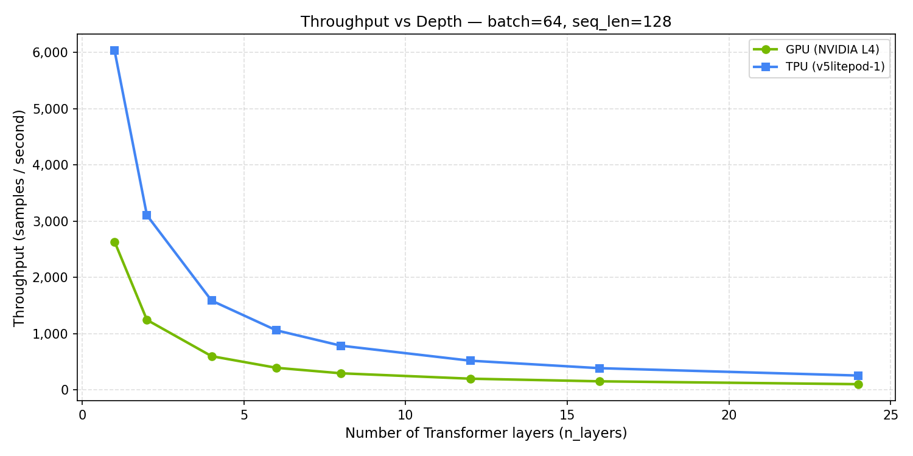
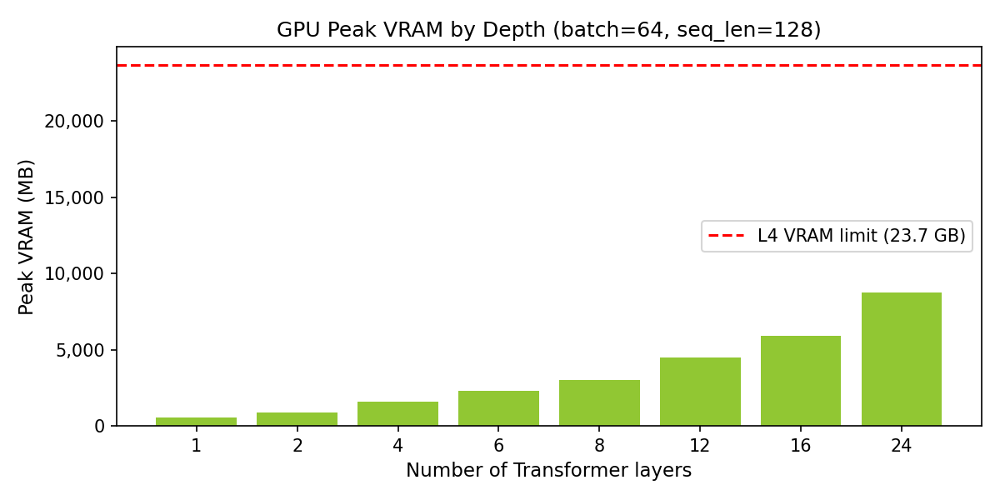

# Session 3: Model Depth and Memory Limits

## Overview

Sessions 1 and 2 measured a single Transformer encoder block. Session 3 scales that
to BERT-base depth (12 layers) and GPT-2 scale (24 layers) to find where each
device runs out of memory.

The experiment fixes `batch=64` and `seq_len=128` and sweeps `n_layers`
[1, 2, 4, 6, 8, 12, 16, 24]. `DeepTransformerModel` is a stack of
`BenchmarkTransformerBlock` instances imported from `transformer_block.py`.
On GPU, `RuntimeError: CUDA out of memory` is caught and recorded; on TPU,
the equivalent XLA runtime error is caught.

Notebooks: [`session_3/`](../session_3/)

---

## Hardware

Same devices as Sessions 1 and 2. See [`session_1.md`](session_1.md) for full specs.

| Device | Memory | Note |
|---|---|---|
| NVIDIA L4 (GPU) | 23.7 GB GDDR6 | Activation memory + optimizer state fills GDDR6 with depth |
| TPU v5litepod-1 | 16 GB HBM2 | Smaller raw capacity but higher bandwidth; OOM may differ |

---

## Benchmark Configuration

| Parameter | Value |
|---|---|
| Model | `DeepTransformerModel(n_layers)` — stack of `BenchmarkTransformerBlock` |
| `D_MODEL` | 512 |
| `N_HEAD` | 8 |
| `DIM_FEEDFORWARD` | 2048 |
| `SEQ_LEN` | 128 (fixed) |
| `BATCH_SIZE` | 64 (fixed) |
| `n_layers` sweep | 1, 2, 4, 6, 8, 12, 16, 24 |
| Steps (n_layers ≤ 4) | 30 (+ 5 warmup) |
| Steps (n_layers ≤ 12) | 20 (+ 5 warmup) |
| Steps (n_layers > 12) | 15 (+ 5 warmup) |
| Loop | forward → backward → Adam step |
| Metric | throughput (samples/sec), peak VRAM (GPU only), OOM boundary |

### Memory cost per layer

Each `BenchmarkTransformerBlock` stores the following tensors during the forward pass
for backpropagation:

| Tensor | Shape | Memory (FP32) |
|---|---|---|
| Input to attention | [64, 128, 512] | ~16 MB |
| Attention weight matrix | [64, 8, 128, 128] | ~32 MB |
| Feedforward intermediate | [64, 128, 2048] | ~64 MB |
| Model parameters (MHA + FF + LN) | ~3.1M params | ~12 MB |
| Gradients (same as params) | ~3.1M params | ~12 MB |
| Adam moments (2× params) | ~6.2M params | ~24 MB |

Approximate activation memory per layer: **~112 MB**.
Total model + optimizer state: **~48 MB per layer** (constant across depth).

At batch=64, the activation memory dominates. Using activation memory alone (112 MB/layer),
the theoretical OOM boundary is roughly n_layers ≈ 23.7×1024 / 112 ≈ 217 layers.
However, this figure **excludes gradients, Adam optimizer states, and allocator overhead**,
which together account for an additional ~245 MB/layer observed empirically (see Results
below). The operational OOM boundary from measured data is approximately 60 layers — see
the Key Takeaways section for the reconciled estimate.

---

## Results

### GPU — Throughput and VRAM by depth

| n_layers | Throughput (samples/sec) | Peak VRAM (MB) | VRAM % of L4 |
|---------:|-------------------------:|---------------:|-------------:|
| 1 | 2,635 | 531 | 2.3% |
| 2 | 1,245 | 890 | 3.9% |
| 4 | 599 | 1,606 | 7.0% |
| 6 | 393 | 2,323 | 10.1% |
| 8 | 295 | 3,039 | 13.2% |
| 12 | 199 | 4,473 | 19.4% |
| 16 | 152 | 5,891 | 25.6% |
| 24 | 101 | 8,772 | 38.1% |

**No OOM observed** across the full [1–24] layer sweep at batch=64. Peak VRAM at
n_layers=24 is 8,772 MB — 38% of the L4's 23,034 MB. BERT-scale (12 layers) fits
at 4,473 MB (19% VRAM). The GPU has headroom for approximately 60 layers before
hitting 23 GB at this batch size.

**VRAM growth per layer:** approximately **357 MB** per additional layer
(from `(8772 - 531) / 23 ≈ 357 MB`). This includes activations, gradients, and
Adam moments for one encoder block.

**Throughput scaling vs n_layers:**

| n_layers | Throughput | Ratio vs n=1 | 1/n expected |
|---------:|-----------:|-------------:|-------------:|
| 1 | 2,635 | 1.00× | 1.00× |
| 2 | 1,245 | 0.47× | 0.50× |
| 4 | 599 | 0.23× | 0.25× |
| 8 | 295 | 0.11× | 0.13× |
| 12 | 199 | 0.075× | 0.083× |
| 24 | 101 | 0.038× | 0.042× |

Throughput scales slightly better than 1/n_layers — each layer adds compute but
there is some constant per-step overhead (data loading, synchronisation) that gets
amortised across more layers.

### TPU — Throughput by depth

| n_layers | Throughput (samples/sec) | Latency (ms/step) | TPU/GPU ratio |
|---------:|-------------------------:|------------------:|--------------:|
| 1 | 6,033 | 10.6 | 2.29× |
| 2 | 3,106 | 20.6 | 2.50× |
| 4 | 1,587 | 40.3 | 2.65× |
| 6 | 1,059 | 60.4 | 2.70× |
| 8 | 786 | 81.5 | 2.67× |
| 12 | 519 | 123.4 | 2.61× |
| 16 | 386 | 166.0 | 2.54× |
| 24 | 255 | 251.5 | 2.52× |

**No OOM observed** across the full [1–24] layer sweep on the TPU v5litepod-1
(16 GB HBM2). Peak depth tested is 24 layers; the TPU has headroom for deeper models.

**TPU/GPU ratio is remarkably stable** — ranging from 2.29× at n=1 to 2.70× at n=6,
then settling at 2.52–2.54× for the deeper configurations. This means the TPU advantage
observed in Session 1 at a single layer holds consistently regardless of model depth.

**TPU throughput scaling vs n_layers:**

| n_layers | TPU samples/sec | Ratio vs n=1 | 1/n expected |
|---------:|----------------:|-------------:|-------------:|
| 1 | 6,033 | 1.00× | 1.00× |
| 2 | 3,106 | 0.51× | 0.50× |
| 4 | 1,587 | 0.26× | 0.25× |
| 8 | 786 | 0.13× | 0.13× |
| 12 | 519 | 0.086× | 0.083× |
| 24 | 255 | 0.042× | 0.042× |

TPU throughput tracks 1/n_layers almost exactly — cleaner than the GPU because the
MXU is purely compute-bound with no memory-bandwidth noise floor.

---

## Charts

### Chart 1 — Throughput vs depth (GPU and TPU, with OOM boundary)

Both lines decline at approximately 1/n_layers. Neither device hits OOM within the
[1–24] layer sweep at batch=64. The TPU advantage is a stable ~2.5× across the full
depth range.

### Chart 2 — GPU Peak VRAM by depth

VRAM grows linearly with depth at ~357 MB per layer. At 24 layers, peak VRAM is
8,772 MB — 38% of the L4's 23.7 GB capacity. The red dashed line marks the L4 limit.

---

## Key Takeaways

- **No OOM on either device within the [1–24] layer sweep at `batch=64`.** GPU peak
  VRAM at 24 layers is 8,772 MB (38% of L4). TPU has no direct VRAM metric but ran
  all 24-layer steps without error on 16 GB HBM2.

- **The GPU's estimated OOM boundary at batch=64 is ~60 layers** (extrapolating the
  measured 357 MB/layer growth rate to 23 GB). Note that this differs from the
  theoretical 217-layer figure in the Benchmark Configuration section: the theoretical
  estimate counts only activation memory (112 MB/layer) and omits gradients, Adam
  states, and allocator overhead. The measured 357 MB/layer captures the full
  per-layer training cost; **~60 layers is the operationally correct estimate**.

- **VRAM cost per encoder block at batch=64: ~357 MB** (activations + gradients +
  Adam moments + allocator overhead). At batch=256, this scales 4× to ~1.4 GB/layer;
  at batch=512 to ~2.8 GB/layer — OOM would occur within the sweep at those batch sizes.

- **Throughput scales as 1/n_layers on both devices.** Each additional encoder block
  adds a fixed compute cost per step. The GPU curve has a slight positive deviation
  from 1/n (constant overhead gets amortised); the TPU tracks 1/n almost exactly,
  consistent with pure compute-bound MXU utilisation.

- **The TPU/GPU throughput advantage is depth-invariant: ~2.5×** across all tested
  depths (2.29× at n=1 to 2.70× at n=6). This matches the Session 1 single-layer
  advantage at batch=64 (2.16×), confirming the ratio is not a single-layer artefact.

- **The VRAM table is a budget planner.** At n_layers=12 (BERT-base), VRAM is 4,473 MB
  on the GPU — well within the L4's limit. If VRAM exceeds 80% of device capacity,
  switch to BF16 (Session 5) or gradient checkpointing before increasing batch size or
  depth.

---

## Decision Rule from This Session

- If your target model (BERT-base, 12 layers, batch=64) fits on GPU, proceed with
  Session 5 to assess whether the dtype choice changes the cost picture.
- If your model hits OOM on GPU before the target depth, add gradient checkpointing
  (`torch.utils.checkpoint`) or switch to BF16 (Session 5) before comparing devices.
- The TPU's 16 GB HBM2 is less than the L4's 23.7 GB, so for very large models the
  GPU may actually fit more layers. Both devices can run all tested configurations here,
  and the TPU's consistent 2.5× throughput advantage holds throughout.
