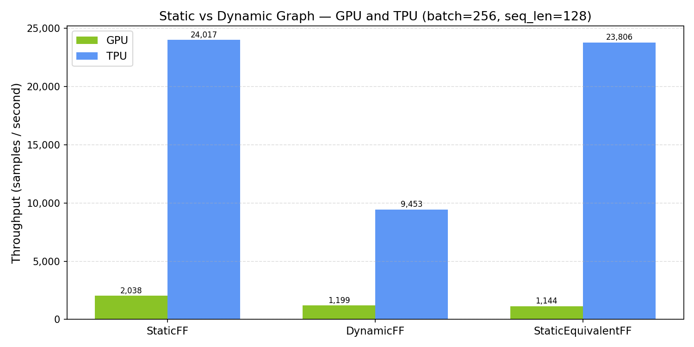
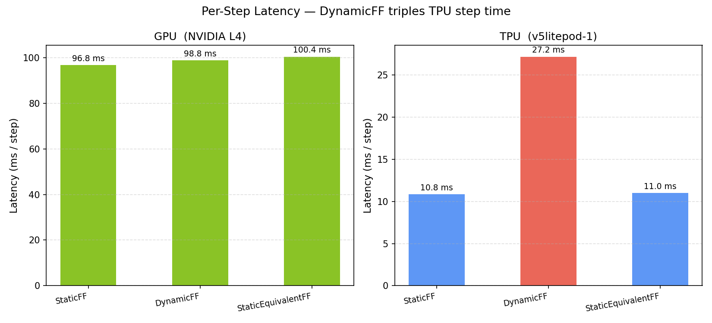

# Session 4: Static vs Dynamic Computation Graphs

## Overview

Session 4 introduces the first scenario where the GPU wins — and then complicates it.
While Sessions 1–3 used fully static forward passes, this session deliberately injects
data-dependent control flow into the model and measures the cost on each device.

The session is structured in two parts:

**Part A — Abstract variants (baseline):** Three minimal variants of the Transformer
block that isolate the XLA compilation penalty from the forward pass structure.

**Part B — Realistic scenarios:** Five scenarios drawn from real NLP and training
practice — padding masks, conditional early exit, and variable-length batch loops —
that show how the static/dynamic constraint manifests in production-like code.

All experiments use `batch=256, seq_len=128` unless stated otherwise.

Notebooks: [`session_4/`](../session_4/)

---

## Hardware

Same devices as Sessions 1–3. See [`session_1.md`](session_1.md) for full hardware specs.

| Device | Memory | Bandwidth | Note |
|---|---|---|---|
| NVIDIA L4 (GPU) | 23.7 GB GDDR6 | ~300 GB/s | Eager execution — but scalar reductions still cost sync |
| TPU v5litepod-1 | 16 GB HBM2 | ~819 GB/s | XLA compiled — Python branches force graph recompilation |

---

## Software Environment

| Component | GPU | TPU |
|---|---|---|
| Python | 3.12.12 | 3.12.12 |
| PyTorch | 2.10.0+cu128 | 2.9.0+cu128 |
| torch_xla | — | 2.9.0 |
| Device string | `cuda:0` | `xla:0` |
| Run timestamp | 2026-03-04T01:17 UTC | 2026-03-04T01:21 UTC |

---

## Background: Why Python branches are expensive on TPU

XLA's execution model is fundamentally different from eager dispatch. Operations are not
dispatched immediately — they are accumulated in a lazy graph until `torch_xla.sync()`
(or an implicit sync) triggers compilation and execution. This deferred model enables XLA
to fuse operations, eliminate redundant memory transfers, and compile the full step into
a single optimised kernel.

When Python code reaches a branch like `if tensor_value > 0`, the Python interpreter
must know the *value* of the condition to choose a path. This requires materialising the
scalar on the host CPU — which forces an implicit XLA sync mid-step:

1. Interrupt lazy graph accumulation
2. Flush, compile, and execute the partial graph
3. Transfer the scalar result to CPU
4. Resume Python, then accumulate the remainder
5. Sync again at the end of the step

Two compilations per step instead of one, plus a device-to-host transfer, plus broken
fusion opportunities.

**On GPU, the picture is more subtle.** PyTorch dispatches every operation immediately
(eager mode), so there is no "compiled graph" to invalidate. However, computing a scalar
reduction like `out.mean()` requires completing the kernel and reading back the result
before the Python interpreter can evaluate the condition. This still creates a
synchronisation point — not as severe as an XLA recompilation, but not free either.

---

## Part A — Abstract variants

### Variant definitions

```python
class StaticFF(nn.Module):
    def forward(self, x):
        return self.block(x)                          # identical to Sessions 1–3

class DynamicFF(nn.Module):
    def forward(self, x):
        out = self.block(x)
        if out.mean() > 0:                            # Python branch on a tensor value
            return out
        else:
            return -out

class StaticEquivalentFF(nn.Module):
    def forward(self, x):
        out = self.block(x)
        return torch.where(out.mean() > 0, out, -out) # tensor op — stays in XLA graph
```

### Part A Results

| Variant | GPU (samples/s) | GPU latency (ms) | TPU (samples/s) | TPU latency (ms) |
|---|---:|---:|---:|---:|
| StaticFF | 2,038 | 125.6 | **24,017** | 10.7 |
| DynamicFF | 1,199 | 213.5 | **9,453** | 27.1 |
| StaticEquivalentFF | 1,144 | 223.7 | **23,806** | 10.7 |

### Relative throughput (vs StaticFF baseline)

| Variant | GPU | TPU |
|---|---:|---:|
| StaticFF | 1.000× | 1.000× |
| DynamicFF | **0.588×** (−41%) | **0.394×** (−61%) |
| StaticEquivalentFF | **0.561×** (−44%) | **0.991×** (−0.9%) |

### Recovery metric (TPU only)

| Metric | Value |
|---|---|
| Static baseline throughput | 24,017 samples/sec |
| Dynamic penalty (lost throughput) | −14,564 samples/sec |
| StaticEquivalent recovery | +14,353 samples/sec |
| **Penalty recovered** | **98.5%** |

### Part A charts

#### Chart 1 — Throughput bar chart: Static / Dynamic / StaticEquivalent



**What the chart shows:**
The TPU's StaticFF and StaticEquivalentFF bars dominate. The DynamicFF bar drops to less
than half on both devices — but `torch.where` restores the TPU bar to near its full height
while the GPU bar remains low. The GPU shows a significant penalty for both DynamicFF and
StaticEquivalentFF.

#### Chart 2 — Latency per step



**What the chart shows:**
TPU DynamicFF latency triples (10.7 ms → 27.1 ms) while GPU latency roughly doubles
(125.6 ms → 213.5 ms). StaticEquivalentFF recovers the TPU to 10.7 ms but leaves the
GPU latency unchanged at 223.7 ms.

---

### Part A Analysis

**TPU DynamicFF: 61% throughput collapse from a single Python `if`.**  Per-step latency
jumps from 10.7 ms to 27.1 ms — a 2.5× slowdown. The cost equals adding more than half
the original compute budget per step.

**`torch.where` recovers 98.5% of the TPU penalty.** The condition stays inside the XLA
graph. No intermediate sync is required. Latency returns to 10.7 ms.

**GPU: DynamicFF also costs ~41%, and `torch.where` does not help.** In eager mode,
evaluating `out.mean() > 0` requires a CUDA kernel to complete, a scalar to be read back
from the device, and then Python to evaluate the condition. This synchronisation point
breaks the GPU's asynchronous pipeline even without a compiled graph. Replacing the Python
`if` with `torch.where` does not avoid computing `out.mean()` — the reduction still runs,
the sync still happens, and throughput stays at ~1,140–1,200 samples/sec.

**The key difference:** On the TPU, the branch causes *recompilation* (which is eliminated
by `torch.where`). On the GPU, the branch causes a *scalar sync* (which is inherent to
computing the condition value, regardless of how it's expressed). `torch.where` solves the
TPU problem; neither device can avoid the cost of the reduction itself.

---

## Part B — Realistic scenarios

### Combined results table

All benchmarks use `batch=256, seq_len=128` except where noted.

| Scenario | Variant | GPU (s/s) | TPU (s/s) | TPU/GPU |
|---|---|---:|---:|---:|
| *(baseline)* | StaticFF | 2,038 | 24,017 | 11.8× |
| B1: Padding mask | PaddingMask | 1,162 | 23,960 | 20.6× |
| B2: Early exit | EarlyExitDynamic | 1,038 | 7,522 | 7.2× |
| B2: Early exit | EarlyExitStatic | 603 | 18,577 | 30.8× |
| B3: Ragged batches | FixedLoopFF | 407 | 15,565 | 38.2× |
| B3: Ragged batches | VariableLoopFF | 806 | 15,520 | 19.3× |

---

### Scenario B1: Padding mask (variable-length sequences in a batch)

**The pattern:** Real NLP batches contain sequences of different lengths. The mask is built
from runtime sequence lengths. A tensor-op mask stays in the XLA graph; a Python loop
forces a `.tolist()` sync per element.

**Result:** `PaddingMask` (tensor-op mask) costs the GPU −43% but costs the TPU only
−0.2%. The TPU handles tensor-valued masking with essentially no overhead — the mask
computation is fused into the XLA program.

**GPU penalty:** The mask reduction still requires a sync even in the tensor-op version.

---

### Scenario B2: Conditional early exit (adaptive computation)

**EarlyExitDynamic** — Python `if confidence > threshold` at each layer:

- GPU: 1,038 s/s (−49% vs StaticFF)
- TPU: 7,522 s/s (−69% — worse than DynamicFF, because the branch evaluates per-layer)

**EarlyExitStatic** — exit condition as a `torch.where` mask, no Python branch:

- GPU: 603 s/s (−70% — *slower* than EarlyExitDynamic; the static version runs every
  layer unconditionally, masking out exited samples, which is more compute than early exit)
- TPU: 18,577 s/s (−23% — significant recovery, though not complete; the per-layer mask
  computation adds overhead that static analysis cannot fully hide)

**Key insight:** The static early exit approach is better for TPU but worse for GPU.
On GPU, the dynamic version benefits from genuinely skipping layers; on TPU, the dynamic
version's recompilation cost exceeds the compute saved, so the static (mask) version wins
despite doing more compute.

---

### Scenario B3: Variable-length batch loop (ragged batches)

**FixedLoopFF** — process each sample in a loop with a fixed number of iterations:

- GPU: 407 s/s (−80% — sequential Python loop eliminates GPU parallelism)
- TPU: 15,565 s/s (−35% — XLA compiles the fixed loop as a single program)

**VariableLoopFF** — variable number of iterations per step (data-dependent loop length):

- GPU: 806 s/s (−60%)
- TPU: 15,520 s/s (−35%)

**Surprising finding:** VariableLoopFF is nearly identical to FixedLoopFF on the TPU
(15,520 vs 15,565 s/s). XLA re-traces on first call but the amortised per-step cost is
the same. On GPU, VariableLoopFF is nearly 2× faster than FixedLoopFF — the variable
loop exits earlier on average, while the fixed loop always runs all iterations.

---

## Combined Key Takeaways

- **Both GPU and TPU pay a cost for data-dependent operations** — but for different
  reasons and with different remedies.

- **GPU penalty (DynamicFF): ~41%.** The scalar reduction `.mean()` requires a
  CUDA-to-CPU sync even in eager mode. `torch.where` does not help because the
  reduction still executes. This is inherent to needing the value at Python level.

- **TPU penalty (DynamicFF): ~61%.** `if out.mean() > 0` forces an XLA graph sync and
  recompilation mid-step. `torch.where` recovers 98.5% — the condition stays in the
  XLA program and no Python-level evaluation occurs.

- **`torch.where` is a one-line TPU fix.** For branches that can be expressed as a
  tensor predicate, refactoring to `torch.where` or `masked_fill` eliminates nearly all
  TPU overhead with no change to model behaviour.

- **Padding masks are essentially free on TPU** (−0.2% vs StaticFF). This is the most
  common dynamic pattern in NLP and it does not constrain TPU suitability.

- **Early exit is genuinely complex.** The static version (mask-based) is better for
  TPU but worse for GPU. For models with early exit, profile both versions on each device
  before choosing.

- **The constraint is often refactorable.** Most branches in research code can be
  replaced with `torch.where`, `masked_fill`, or boolean masking. When they cannot
  (e.g., truly variable routing per sample), the GPU may be the simpler choice.

---

## Decision Rule from This Session

If your model's control flow depends on a tensor value:

1. **Is the condition derivable from a tensor op (`mean`, `max`, `norm`, threshold)?**
   → Yes: use `torch.where` / `masked_fill` — near-full TPU recovery, moderate GPU cost.
   → No (Python-level routing): GPU avoids recompilation; TPU may still be faster overall.

2. **Does your training loop iterate over variable-length or ragged inputs?**
   → Pad to a fixed shape. The fixed shape compiles once; the ragged loop recompiles.
   → TPU still wins significantly (38× at FixedLoopFF) even with looping overhead.

3. **Is early exit critical?**
   → The static mask version favours TPU; the dynamic version favours GPU at this scale.
   → Benchmark both if early exit is a core architectural feature.
