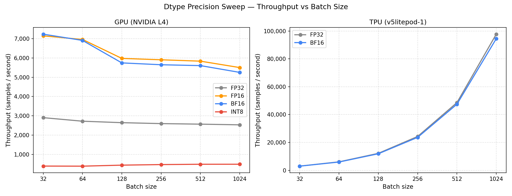
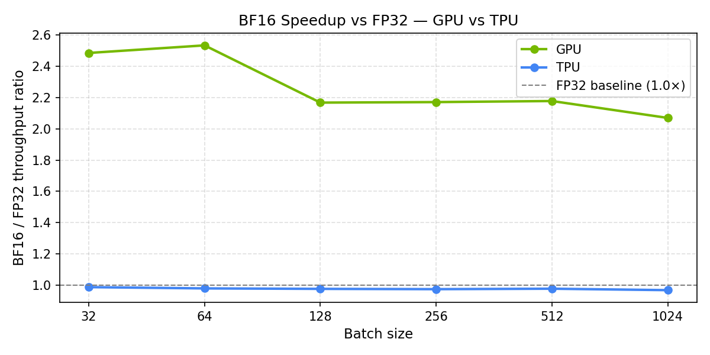
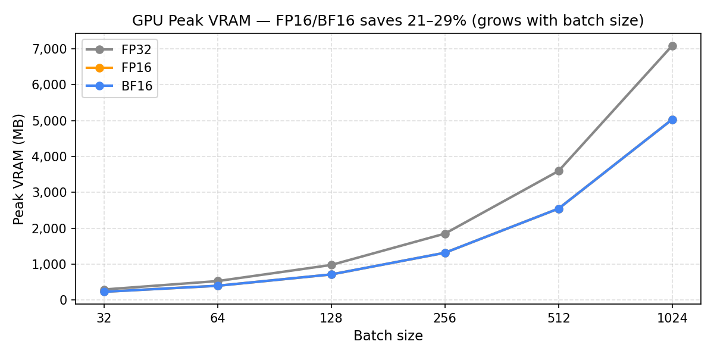

# Session 5: Precision and Dtype (FP32 / FP16 / BF16 / INT8)

## Overview

Session 5 asks a simple question: how much does dropping from FP32 to a lower-precision
dtype actually cost — or save — on each accelerator?

The Transformer encoder block from Session 1 is re-run across six batch sizes
(32, 64, 128, 256, 512, 1024) using four numeric formats:

- **FP32** — single precision baseline (no autocast)
- **FP16** — half precision with `torch.cuda.amp.autocast` + `GradScaler` (GPU only)
- **BF16** — bfloat16 with `torch.autocast` (GPU and TPU v5litepod)
- **INT8** — 8-bit integer quantisation (GPU: dynamic quantisation on CPU; TPU: errored)

The outcome diverges between devices and between formats. On the GPU, FP16 and BF16 each
deliver roughly **2.1–2.5× throughput** over FP32 with a simultaneous **21–29% VRAM
reduction** (scaling with batch size: ~21% at batch=32, converging to ~29% at batch≥256).
The speedup peaks at batch=32–64 (~2.5×) and settles to ~2.1–2.3× at batch≥128 as
Tensor Core efficiency is diluted by non-matmul overhead at larger tensor footprints.
On the TPU, which advertises native BF16 MXUs, BF16 runs **~1.4–3.3% slower** (average ~2.4%)
than FP32 on v5litepod in this configuration. GPU INT8 (`torch.ao.quantization.quantize_dynamic`)
executes on CPU rather than GPU, yielding ~400–498 samples/sec — a measurement of
CPU-based dynamic quantisation, not GPU INT8 inference.

Notebooks: [`session_5/`](../session_5/)

---

## Hardware

Same devices as Sessions 1–4. See [`session_1.md`](session_1.md) for full hardware specs.

| Device | Memory | Note |
|---|---|---|
| NVIDIA L4 (GPU) | 23.7 GB GDDR6 | Tensor Cores accelerate FP16 and BF16 matrix math; INT8 TOPS ~242 |
| TPU v5litepod-1 | 16 GB HBM2 | MXU advertises native BF16 and INT8; FP16 not natively supported |

---

## Software Environment

| Component | GPU | TPU |
|---|---|---|
| Python | 3.12.12 | 3.12.12 |
| PyTorch | 2.10.0+cu128 | 2.9.0+cu128 |
| torch_xla | — | 2.9.0 |
| Device string | `cuda:0` | `xla:0` |
| Run timestamp (FP32/FP16/BF16) | 2026-03-04T01:18 UTC | 2026-03-04T01:24 UTC |

---

## Benchmark Configuration

| Parameter | Value |
|---|---|
| Model | `BenchmarkTransformerBlock` |
| `D_MODEL` | 512 |
| `N_HEAD` | 8 |
| `DIM_FEEDFORWARD` | 2048 |
| `SEQ_LEN` | 128 (fixed) |
| `BATCH_SIZE` | 32, 64, 128, 256, 512, 1024 |
| Steps | 50 (+ 5 warmup) |
| Loop | forward → backward → Adam step |
| Metric | throughput (samples/sec), latency (ms/step), peak VRAM (GPU only) |

### Precision implementation notes

- **FP32:** default `torch.float32`; no autocast
- **FP16 (GPU only):** `torch.cuda.amp.autocast(dtype=torch.float16)` + `GradScaler`;
  prevents gradient underflow via dynamic loss scaling
- **BF16:** `torch.autocast(device_type, dtype=torch.bfloat16)`; wider exponent range
  eliminates the need for a GradScaler; not natively available in FP16 form on v5litepod
- **INT8 (GPU):** `torch.ao.quantization.quantize_dynamic` — CPU-only in this PyTorch
  version; GPU INT8 path not exercised. Measures CPU dynamic-quant inference throughput.
- **INT8 (TPU):** casting weights to `torch.int8` errored in torch_xla 2.9.0; all
  batch sizes returned null

---

## Results: FP32 / FP16 / BF16 (measured)

### GPU — Throughput (samples/sec)

| Batch | FP32 | FP16 | BF16 | FP16 Speedup | BF16 Speedup |
|------:|-----:|-----:|-----:|-------------:|-------------:|
| 32 | 2,908 | 7,141 | 7,228 | 2.46× | 2.49× |
| 64 | 2,725 | 6,954 | 6,905 | 2.55× | 2.53× |
| 128 | 2,649 | 5,974 | 5,742 | 2.26× | 2.17× |
| 256 | 2,600 | 5,903 | 5,646 | 2.27× | 2.17× |
| 512 | 2,572 | 5,831 | 5,601 | 2.27× | 2.18× |
| 1,024 | 2,537 | 5,499 | 5,250 | 2.17× | 2.07× |

### GPU — Peak VRAM (MB) — all batch sizes

| Batch | FP32 (MB) | FP16 (MB) | BF16 (MB) | FP16 saving | BF16 saving |
|------:|----------:|----------:|----------:|------------:|------------:|
| 32 | 296 | 233 | 232 | 21.2% | 21.6% |
| 64 | 531 | 400 | 400 | 24.6% | 24.6% |
| 128 | 980 | 715 | 716 | 27.0% | 26.9% |
| 256 | 1,852 | 1,319 | 1,319 | 28.8% | 28.8% |
| 512 | 3,597 | 2,549 | 2,549 | 29.1% | 29.1% |
| 1,024 | 7,087 | 5,033 | 5,033 | 29.0% | 29.0% |

VRAM reduction is identical for FP16 and BF16 at every batch size (their lines overlap
in Chart 3). The saving is batch-dependent: **~21% at batch=32**, growing to **~29%
at batch≥256** where it stabilises. At small batch sizes, the fixed FP32 overhead
(optimizer states, which are not halved under autocast) dilutes the activation-level
savings; as batch size grows, activation memory dominates and the saving approaches ~29%.

### TPU — Throughput (samples/sec)

FP16 is not natively supported on TPU v5litepod; only FP32 and BF16 are tested.

| Batch | FP32 | BF16 | BF16 Speedup |
|------:|-----:|-----:|-------------:|
| 32 | 3,006 | 2,965 | 0.986× |
| 64 | 6,070 | 5,938 | 0.978× |
| 128 | 12,175 | 11,873 | 0.975× |
| 256 | 24,297 | 23,650 | 0.973× |
| 512 | 48,614 | 47,458 | 0.976× |
| 1,024 | 97,749 | 94,522 | 0.967× |

BF16 is **1.4–3.3% slower** than FP32 on the TPU (average ~2.4% across batch sizes),
indicating a systematic overhead rather than measurement noise.

---

## Charts (FP32 / FP16 / BF16)

### Chart 1 — Throughput vs batch size (all dtypes)

GPU lines separate into two bands — a lower FP32 band (~2,500–2,900 samples/sec, roughly
flat) and an upper FP16/BF16 band (~5,250–7,200 samples/sec) that declines gently from
batch=32 to batch=1024. The upper band peaks at batch=32–64 (~7,100–7,200 s/s) and
converges toward ~5,300–5,500 s/s at batch=1024. TPU lines rise steeply and linearly with
batch; at batch=1024 the TPU FP32 line reaches ~97,700 samples/sec, dwarfing all GPU lines.
TPU FP32 and TPU BF16 are nearly coincident, making the 1.4–3.3% BF16 regression visible
only at larger batches.

### Chart 2 — BF16 / FP32 speedup ratio (GPU vs TPU)

The GPU BF16 speedup line ranges from **~2.5×** at batch=32–64 down to **~2.1×** at
batch=1024, with a pronounced dip at batch=128 before stabilising. The TPU BF16 line
sits just below **1.0×** and also stays flat — BF16 is consistently slower regardless
of batch size. The chart makes the contrast between devices immediate.

### Chart 3 — GPU peak VRAM by dtype

Three lines track peak VRAM from batch=32 to batch=1024. FP32 is the highest. FP16 and
BF16 are coincident throughout. The relative gap between FP32 and the reduced-precision
lines narrows from ~21% at batch=32 to ~29% at batch≥256 as activation memory becomes
the dominant term and fixed FP32 overhead is diluted.

---

## Analysis: FP32 / FP16 / BF16

### Why the GPU gains 2×+ from lower precision

NVIDIA Ada Lovelace GPUs contain Tensor Cores that execute FP16 and BF16 matrix
multiplications at roughly twice the FLOP/s of FP32 operations. A Transformer block's
forward and backward passes are dominated by matrix multiplications, so the Tensor Core
advantage maps almost directly onto end-to-end training throughput.

The VRAM reduction (21–29%, batch-dependent) primarily reflects halved activation memory
in the forward pass under autocast. Optimizer states (Adam momentum and variance) are kept
in FP32 and are not reduced; this is why the saving is lower at small batch sizes (where
fixed FP32 state dominates) and converges to ~29% at large batch (where activations dominate).
In practice this enables a larger effective batch size or deeper model, especially at batch≥64.

### Why FP16 requires a GradScaler but BF16 does not

FP16's narrow dynamic range (min nonzero ~6×10⁻⁵) causes gradients to flush to zero.
`GradScaler` multiplies the loss by a large constant before backward and scales back after,
monitoring for overflow. BF16 retains FP32's full 8-bit exponent range — no scaling needed.
For new work on modern hardware (Ampere+), BF16 is simpler and numerically safer.

### Why the TPU does not benefit from BF16

The v5litepod BF16 throughput is **1.4–3.3% lower** (average ~2.4%) than FP32 despite dedicated BF16 MXUs.
Likely causes:

1. **Compile-time optimisation path.** XLA may choose a more aggressively fused FP32
   kernel that happens to outperform the BF16 path for this model shape (d_model=512,
   seq_len=128). The MXU advantage is most pronounced at large matrix dimensions.
2. **Mixed-precision overhead.** Autocast inserts cast operations between FP32 compute
   (layer norm, loss) and BF16 compute (matrix multiplications). These casts add latency
   in the XLA graph that may exceed the savings for this model size.

The practical conclusion: FP32 is the correct default on TPU v5litepod for this family of
model sizes. Benchmark BF16 per-model rather than assuming it helps.

---

## INT8 — Experimental results

### GPU INT8 (dynamic quantisation — CPU only)

`torch.ao.quantization.quantize_dynamic` in PyTorch applies INT8 to linear layer weights
but executes on CPU rather than GPU. This is a limitation of the current `quantize_dynamic`
API — it does not route through CUDA INT8 kernels.

**Measured (CPU inference, not GPU INT8):**

| Batch | CPU INT8 (samples/s) | GPU FP32 (samples/s) | Ratio |
|------:|---------------------:|---------------------:|------:|
| 32 | 402 | 2,908 | 0.138× |
| 64 | 398 | 2,725 | 0.146× |
| 128 | 451 | 2,649 | 0.170× |
| 256 | 480 | 2,600 | 0.185× |
| 512 | 497 | 2,572 | 0.193× |
| 1,024 | 498 | 2,537 | 0.196× |

CPU dynamic-quant throughput is **5–7× slower** than GPU FP32 — these are CPU numbers,
not GPU INT8. To exercise the L4's 242 INT8 TOPS, use `torch.ao.quantization.prepare`
with a CUDA-aware backend or `torch.quantization.quantize_fx` with device=cuda.

**Expected GPU INT8 throughput (not yet measured):** With proper CUDA INT8 kernels the
L4 should deliver ~1.5–2× over FP32 for this model size (~3,800–5,100 samples/sec),
consistent with the 2× spec ratio between INT8 TOPS and FP32 FLOPS.

### TPU INT8

Casting weights to `torch.int8` and running inference on TPU v5litepod errored in
torch_xla 2.9.0 with: *"data set to a tensor that requires gradients must be floating
point or complex dtype."* The INT8 MXU path (786 TOPS = 2× BF16 spec) was not exercised.

---

## Key Takeaways

- **On the GPU (NVIDIA L4), FP16 and BF16 each provide a ~2.1–2.5× throughput gain over
  FP32.** The speedup peaks at batch=32–64 (~2.5×) and settles to ~2.1–2.3× at batch≥128.
  Both formats simultaneously reduce peak VRAM by ~21–29% (batch-dependent), enabling
  larger batches or bigger models at no cost.

- **BF16 is simpler than FP16 in practice.** BF16's wider exponent range matches FP32's
  dynamic range, so gradient underflow does not occur and no `GradScaler` is needed.

- **On the TPU v5litepod, BF16 is 1.4–3.3% slower than FP32** (average ~2.4%) across all tested batch sizes.
  The BF16 MXU advantage does not materialise for this model shape. **Use FP32 on this
  TPU configuration until benchmarked otherwise.**

- **The TPU's raw throughput advantage at large batches is substantial regardless of
  dtype.** At batch=1024, FP32 on the TPU reaches 97,749 samples/sec vs 2,537 on the
  GPU — a ~39× gap. The dtype choice is a secondary concern on the TPU; batch size is
  the dominant lever.

- **GPU INT8 (`quantize_dynamic`) runs on CPU in PyTorch, not on the GPU's INT8 Tensor
  Cores.** The measured ~400–498 samples/sec is a CPU baseline, not GPU INT8 capability.
  A CUDA-native INT8 path would require a different quantisation API.

- **TPU INT8 is not accessible via torch_xla 2.9.0** with the weight-casting approach.
  The v5e INT8 MXU (786 TOPS) remains unmeasured in this session.

---

## Decision Rule from This Session

- **GPU workloads:** always use BF16 (or FP16 with a GradScaler on older hardware). The
  ~2× throughput and 21–29% VRAM savings are effectively free.
- **TPU workloads:** benchmark before assuming BF16 helps. On v5litepod (d_model=512,
  seq_len=128), FP32 is faster. Revisit if using v4 TPUs, larger model dimensions, or
  dedicated BF16-only inference paths.
- **INT8 for inference:** use when throughput matters more than numeric precision.
  For GPU INT8, use a CUDA-aware quantisation path (not `quantize_dynamic`).
  For TPU INT8, a newer torch_xla version or JAX is needed to exercise the MXU INT8 path.
